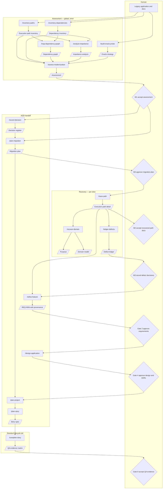

# Modernization Lane

Artifact-Driven Development can start from a raw idea, or it can start from an existing application that needs to be ported to a new language, framework, architecture, or operating model.

The main delivery workflow does not change. Purpose, domain, requirements, design, stories, implementation, review, QA, documentation, and validation still provide the trace from intent to evidence. Modernization adds an upstream lane that examines the legacy system first, recovers what is knowable, grades the evidence, and decides how much parity can honestly be proved.

The rule is simple: the legacy application is evidence, not automatically the requirement. User documentation, release notes, executable behavior, source code, and commit history can disagree. The modernization lane preserves those disagreements until a human decision resolves them.

Two further rules keep the lane usable:

1. **Global analysis informs. Slice prerequisites gate.** Inventories describe the whole legacy system. They do not decide whether a given slice may start.
2. **Analysis is a snapshot. Decisions are living.** Later work cites an analysis artifact; it does not rewrite it.

---

## Design Principles

These rules bind every modernization command, template, and agent.

**A. One owner, one writer.** Each artifact has one owning agent. Only that agent may write it. Other agents consume it. If a later phase needs to override a finding, the override goes in the later phase's own artifact with a citation.

**B. Analysis is immutable after snapshot.** Execution-path inventory, dependency inventory, path details, dependency graph, and impedance analysis describe *what is*. After `Status: Snapshot`, the owner may append `## Errata` or produce a new version. Nobody edits table cells in place to record a later decision.

**C. Decisions are mutable and live in one place.** The decision register, defect ledger, migration plan, ADRs, and story specs describe *what we will do*. Current state belongs in the cell. History belongs in version control. Do not add prose preambles that narrate how a cell used to read.

**D. Slice prerequisites gate delivery.** Each slice (and the ADD story that implements its recovered `Sn` IDs) carries a short prerequisite table naming the specific `DEP-NNN`, `DEC-NNN`, and `DEF-NNN` IDs that bind it. A global count such as "16 of 33 dependency routes are unresolved" never blocks a slice that does not use those routes.

**E. Templates are conditional.** Omit sections that do not apply to the discovered source or target stack. Do not fill them with "not applicable" rows. Reserve, retired, and suspected-dead items belong in an appendix, not interleaved with active work.

**F. Evidence grades are singular.** Each claim gets exactly one grade — the weakest grade that applies to the actionable part of the claim. If sub-claims differ, split them into separate rows.

**G. Cross-references do not duplicate state.** A tension, conflict, or finding is recorded once, in the artifact that owns that concern. Other documents link by ID.

**H. Every document opens with one paragraph.** The summary says what the document covers, the key findings, and where to look next. No document should require reading four others to answer a basic question.

**I. Brevity is a feature.** An artifact earns its keep if it helps a human decide what to port, retire, rewrite, substitute, or sequence. Traceability does not require restating the same fact in four taxonomies.

---

## High-Level Flow



The modernization lane has three phases:

1. **Assessment** decides whether the port is feasible and what conditions must be true before *any* slice starts. Its artifacts are global and short.
2. **Recovery** is slice-scoped. It traces only the execution paths in the next slice, recovers purpose/domain terms those paths require, and ledgers defects that bind those paths.
3. **Handoff into ADD.** `/refine-feature` writes ordinary `REQ-NNN` files whose scenarios carry legacy provenance. `/plan-migration` sequences slices. From there, design, backlog, stories, implementation, review, QA, and documentation are the standard lifecycle.

The per-slice ADD loop is: **recover → refine → design → implement → QA**. Global analysis feeds that loop. It does not replace it. Design is holistic over the accumulating requirements set; it is not invented inside a one-path port story.

The configured design doc (default `README.md`) is the repo hub. `/assess-modernization` creates it if it is missing, including a `## Modernization` section: what this port is, lane status, and an index of links. That section is omitted on greenfield projects. Design sections (architecture, stack, getting started, and so on) stay out of the file until `/design-application`. Each modernization command updates only the hub cells it owns — see [the README template](assets/templates/readme-template.md).

---

## Artifact Ownership

| Artifact | Owner (writer) | Command | Recorded in | Kind |
|---|---|---|---|---|
| Execution path inventory | Archaeologist | `/inventory-paths` | `docs/modernization/execution-path-inventory.md` | Analysis snapshot |
| Dependency inventory | Migration Strategist | `/inventory-dependencies` | `docs/modernization/dependency-inventory.md` | Analysis snapshot |
| Dependency graph | Archaeologist | `/map-dependency-graph` | `docs/modernization/dependency-graph.md` | Analysis snapshot |
| Technology and impedance analysis | Migration Strategist | `/analyze-impedance` | `docs/modernization/impedance-analysis.md` | Analysis snapshot |
| Oracle strategy | Implementer | `/build-oracle` | `docs/modernization/oracle.md` | Analysis snapshot (tier); harness files may grow |
| Modernization assessment | Migration Strategist | `/assess-modernization` | `docs/modernization/ASSESSMENT.md` | Decision (M1) |
| Execution path detail | Archaeologist | `/trace-path` | `docs/modernization/paths/XP-NNN-*.md` | Analysis snapshot |
| Defect ledger | Archaeologist records; human decides | `/ledger-defects` | `docs/modernization/defect-ledger.md` | Decision (M3) |
| Decision register | Migration Strategist records; human decides | `/record-decision` | `docs/modernization/decision-register.md` | Decision |
| Migration plan | Migration Strategist | `/plan-migration` | `docs/modernization/migration-plan.md` | Decision (M4) |
| Refined requirements | Architect | `/refine-feature` | `docs/requirements/REQ-NNN-*.md` | Decision (Gate 2); the ADD handoff |
| Story spec | Architect | `/plan-story` | `docs/features/{STORY-ID}-*.md` | Decision (Gate 7) |
| QA evidence matrix | QA | `/qa-story` | Story spec QA section | Evidence (Gate 8; includes `parity` rows) |
| Modernization hub (bundled in README) | Split by section — see the README template | `/assess-modernization` creates; each producing command updates its index row | Configured design doc `## Modernization` | Navigation |

The Archaeologist builds the dependency *graph* (which paths use which modules and dependencies). The Migration Strategist *uses* that graph in the assessment and migration plan. Sequencing analysis does not get written back into the graph.

Comparison rules live on the covering `REQ-NNN`. QA verifies `parity` test rows in the ordinary evidence matrix. There is no separate path-test-plan file, port-story template, or parity report.

---

## Snapshot, Errata, And Versions

Analysis artifacts use this header contract:

- `**Status:** Draft` — the owning command may still rewrite rows.
- `**Status:** Snapshot` — the phase that produced it has completed. Table cells are frozen.
- `**Version:** vN` — increment when the owner replaces the snapshot with a new one.

After Snapshot:

- **Do not** edit a cell to record a later decision, status, or "we decided this is fine."
- **Do** record the decision in the decision register, defect ledger, covering `REQ-NNN`, migration-plan slice row, or story spec, citing the analysis ID.
- **Do** append `## Errata` when a factual error is found (wrong path, wrong citation). An erratum names the row ID, the correction, the evidence, and the date.
- **Do** produce `vN+1` when new evidence changes the snapshot's substance. Git is the history of vN.

Decision artifacts stay mutable. Their tables show current state. Do not keep a prose changelog in the file.

---

## Modernization Gates

The greenfield workflow has nine human gates. Modernization adds four more. M1 and M4 are project-level. M2 and M3 are re-entered for each slice. Parity evidence is Gate 8: when a story has `parity` test rows, those criteria are part of the QA matrix.

| Gate | What is being decided | What the human is looking for |
|---|---|---|
| M1. Accept assessment verdict | Is this modernization feasible enough to start the first slice? | `go`, `go-with-conditions`, or `no-go`; a one-page `ASSESSMENT.md`; oracle tier; first-slice conditions only; walking-skeleton feasibility. Global unresolved dependencies that do not bind the first slice are not M1 blockers. |
| M2. Accept recovered documentation | Is the *current slice's* path-detail evidence strong enough to plan against? | In-scope `XP-NNN` details at `Ready for Requirements`; singular evidence grades; no unaccepted `E4 inferred` or `E5 unknown` claims in that slice. Other slices may still be inventory-only. |
| M3. Record defect decisions | Should suspicious legacy behavior in *this slice* be reproduced, fixed now, or fixed later? | Each in-scope `DEF-NNN` names one or more `XP-NNN` IDs and has one decision: `reproduce-faithfully`, `fix-now`, or `fix-later`. A defect that asks a system-wide question the methodology says has no system-wide answer is mis-posed: decompose it or close it. |
| M4. Approve migration plan | Is this the right staging, cutover, and structure-fidelity strategy? | Chosen strategy (`strangler`, `phased-rewrite`, or `big-bang-parallel-run`); slice order; each slice's prerequisite table; covered `XP-NNN` / `Sn`; oracle evidence; ADR implications; rollback; forecast confidence. Later slices may be inventory IDs until their recovery runs. |

These gates do not replace the greenfield gates. They add the decisions that only brownfield work needs. After M2/M3, `/refine-feature` produces the REQ that Gate 2 already knows how to approve.

---

## Phase 1: Assessment

Assessment answers: *Can this legacy application be migrated with credible evidence, and what would make the first slice unsafe?*

The five-minute picture lives in `docs/modernization/ASSESSMENT.md`. Inventories behind it are reference, not a second narrative.

`/assess-modernization` is the orchestrator. It runs or consumes:

1. `/inventory-paths`
2. `/inventory-dependencies`
3. `/map-dependency-graph`
4. `/analyze-impedance`
5. `/build-oracle probe`
6. `/assess-modernization` (synthesis)

`/record-decision` runs whenever an owner choice is needed. It is not a required step in the sequence; open `DEC-NNN` rows that bind the first slice become M1 conditions.

### `/inventory-paths`

- **Inputs.** Legacy repository path, optional scope.
- **Agent.** Archaeologist.
- **Artifact.** `docs/modernization/execution-path-inventory.md`.
- **Exit.** Every executable path — CLI, library API entry point, batch job, service endpoint, scheduled task, event handler — has an `XP-NNN` ID, trigger, one-line description, and status (`active`, `suspected-dead`, or `unknown`). Active paths are the main table. Suspected-dead, unknown, and retired paths go in an appendix. History is used only to classify status, not to produce a separate intent ledger.

### `/inventory-dependencies`

- **Inputs.** Legacy repository, source stack, target stack when known.
- **Agent.** Migration Strategist.
- **Artifact.** `docs/modernization/dependency-inventory.md`.
- **Exit.** Each external dependency has a `DEP-NNN` ID, version (known or unknown), license, support status, and exactly one disposition:

| Disposition | Meaning |
|---|---|
| `available` | A credible target-stack equivalent exists. |
| `reimplementable` | No direct equivalent, but the needed behavior is bounded enough to rewrite. |
| `undecided` | An owner decision is needed. Name the question; do not call this blocked. |
| `no-route` | No known replacement. This disposition blocks *paths that use it*, not the whole program. |

Do not use `blocked`. Fourteen owner-pending rows and two dead ends must not look identical.

Dispositions are snapshot classifications. A later substitution choice is a `DEC-NNN` (and an ADR when it binds the target design). The inventory row stays as classified.

### `/map-dependency-graph`

- **Inputs.** Path inventory, dependency inventory, legacy repository.
- **Agent.** Archaeologist.
- **Artifact.** `docs/modernization/dependency-graph.md`.
- **Exit.** A join table answering: if I port path X, which internal modules and `DEP-NNN` IDs come with it? If dependency Y is `no-route`, which paths are affected? If a used dependency is missing from the inventory, stop and return to `/inventory-dependencies`. Do not add `DEP-NNN` rows from this command.

### `/analyze-impedance`

- **Inputs.** Source stack, target stack, path inventory, dependency inventory, dependency graph.
- **Agent.** Migration Strategist.
- **Artifact.** `docs/modernization/impedance-analysis.md`.
- **Exit.** Source and target characteristics that actually affect porting, plus `IMP-NNN` mismatches with severity, affected `XP-NNN` IDs, and a candidate pattern (`preserve`, `wrap`, `rewrite`, `adapter`). Include a seeded language-family section only when that family is the discovered source stack. Omit the rest entirely.

### `/build-oracle probe`

- **Inputs.** Legacy repository, setup docs.
- **Agent.** Implementer, with oracle-tier constraints from the Migration Strategist.
- **Artifact.** `docs/modernization/oracle.md`.
- **Exit.** The legacy oracle is classified as `T1 executable`, `T2 recorded`, or `T3 documented-only`. Containment, determinism, and environment facts that affect the *tier* are recorded. Per-path fixtures and comparison rules do not live here; they live on the covering `REQ-NNN` (section 4b).

### `/assess-modernization`

- **Inputs.** The five assessment artifacts, target stack, and source docs.
- **Agent.** Migration Strategist.
- **Artifact.** `docs/modernization/ASSESSMENT.md`.
- **Human gate.** **M1: Accept assessment verdict.**
- **Exit.** A `go`, `go-with-conditions`, or `no-go` verdict that a reader can understand in under five minutes: what exists, oracle tier, first-slice candidate, conditions that actually bind that slice, and where to look next.

---

## Phase 2: Recovery

Recovery answers: *What does this slice's execution paths do, how do we know, and what remains uncertain?*

Do not catalog the entire legacy system before the first slice. The path inventory already says what exists. `/document-legacy` takes a scope — typically the next slice's `XP-NNN` IDs — and runs:

1. `/trace-path` for each in-scope path (or logical group)
2. `/recover-domain` from those details plus user docs
3. `/ledger-defects` for mismatches those paths surface

### `/trace-path`

- **Inputs.** One `XP-NNN` (or a named group), the path inventory, and the legacy repository.
- **Agent.** Archaeologist.
- **Artifact.** `docs/modernization/paths/XP-NNN-*.md`.
- **Human gate.** Supports **M2** for the current slice.
- **Exit.** Sequence of operations, internal and external dependencies, data flow, edge cases and error handling as the code actually behaves, and one evidence grade per claim. This document feeds `/refine-feature`. It does not include target design, slice status, or decision preambles.

Related paths may share one detail document when they are the same operation with different triggers. Unrelated paths do not.

### `/recover-domain`

- **Inputs.** In-scope path details, user docs, release notes, defect ledger, existing purpose/domain artifacts.
- **Agent.** Modeler in legacy recovery mode.
- **Artifacts.** `docs/PURPOSE.md` and `docs/DOMAIN.md`.
- **Human gate.** Supports the standard purpose/domain approvals and **M2**.
- **Exit.** Purpose and domain model recovered from evidence only. `E4 inferred` and `E5 unknown` claims remain open questions when they affect design or story planning. Implementation names are candidate terms, not domain truth.

### `/ledger-defects`

- **Inputs.** Bug reports, support notes, path details, oracle mismatches, suspicious legacy behavior.
- **Agent.** Archaeologist.
- **Artifact.** `docs/modernization/defect-ledger.md`.
- **Human gate.** **M3: Record defect decisions** for defects that bind the current slice.
- **Exit.** Each `DEF-NNN` names the affected `XP-NNN` ID(s) and a decision: `reproduce-faithfully`, `fix-now`, or `fix-later`. Refuse a defect that asks a system-wide question (for example a single numeric tolerance for every path) when the methodology requires a per-path answer. Split it, or record a `DEC-NNN` that says comparison is per path, and close the mis-posed defect.

Open defect decisions for *other* slices do not block this slice.

### `/document-legacy`

- **Inputs.** Accepted or conditionally accepted assessment, a slice or `XP-NNN` scope, user documentation.
- **Agent.** Orchestrates Archaeologist and Modeler.
- **Artifacts.** Path details, purpose, domain model, defect ledger rows for that scope.
- **Human gate.** **M2** and **M3** for the scoped slice.
- **Exit.** Recovered artifacts are ready to feed `/refine-feature` for that slice. The REQ is the handoff into ADD.

---

## Phase 3: Handoff Into ADD

Planning answers: *How should the migration be sliced, and how does recovered evidence become ordinary requirements, design, and stories?*

### `/record-decision`

- **Inputs.** The question, the human's answer, the evidence, and the `XP-NNN` / `DEP-NNN` / `IMP-NNN` / `DEF-NNN` IDs it affects.
- **Agent.** Migration Strategist records; the human decides.
- **Artifact.** `docs/modernization/decision-register.md`.
- **Exit.** Every porting decision — port, retire, rewrite, substitute, reproduce vs fix as policy, comparison policy — has a `DEC-NNN` row: question, answer, evidence, date, affected IDs. "What did we decide about X?" has one location. Do not restate the answer in analysis ledgers. A `DEC` that binds target design still needs an ADR, written by the Architect.

### `/plan-migration`

- **Inputs.** Accepted assessment, decision register, path inventory, dependency graph, impedance analysis, oracle doc, recovered purpose/domain when present, defect ledger, target stack.
- **Agent.** Migration Strategist.
- **Artifact.** `docs/modernization/migration-plan.md`. Recommend ADRs; do not take over the Architect's ADR files.
- **Human gate.** **M4: Approve migration plan.**
- **Exit.** A staging strategy, slice plan, and per-slice prerequisite table. A slice may be listed as inventory `XP-NNN` IDs before those paths are detailed. Each slice names only the `DEP-NNN`, `DEC-NNN`, and `DEF-NNN` IDs that bind *that* slice. Recalibrate forecast after the first completed slice.

The per-slice loop in the plan is recover → refine → design → implement → QA. Check off a resolved prerequisite in the slice row or the ADD story, not in the global inventory. `/plan-project` consumes this plan as sequencing, not as a second backlog.

### `/refine-feature`

- **Inputs.** In-scope path details, defect decisions, decision register, oracle tier, user docs.
- **Agent.** Architect.
- **Artifact.** `docs/requirements/REQ-NNN-*.md` with section **4b. Legacy provenance**.
- **Human gate.** Standard **Gate 2: Approve refined requirements.**
- **Exit.** Ordinary Gherkin `Sn` scenarios whose provenance table names `XP-NNN`, one evidence grade, binding `DEC-NNN` / `DEF-NNN`, the comparison rule, and the oracle source. Unresolved `E4` / `E5` without a `DEC-NNN` stay in Open questions. Suggested ADR triggers that bind target design are listed for `/design-application`. This is the handoff. Do not write a path test plan or port story.

### `/design-application` and `/plan-project`

- **Inputs.** Accumulating `REQ-NNN` files, recovered purpose/domain, migration plan, recommended ADR triggers.
- **Agent.** Architect.
- **Artifacts.** README design sections, ADRs, backlog epics/stories ordered from the migration plan.
- **Human gates.** **Gate 4** and **Gate 6**.
- **Exit.** Holistic target design over the requirements set that exists so far. Later slices add REQ files and may produce a design delta; they do not invent a parallel architecture inside a one-path story.

### `/plan-story` and `/complete-story`

- **Inputs.** Approved backlog row, linked `REQ-NNN` (including section 4b when present), purpose, domain, ADRs, design, migration-plan prerequisites for the covered `XP-NNN`.
- **Agent.** Architect plans; Implementer, Auditor, QA, and Docs-PM complete.
- **Artifact.** Ordinary `docs/features/{STORY-ID}-*.md` using the user-story template. When the REQ has provenance, the story copies section 1b, slice prerequisites, and `parity` test rows.
- **Human gates.** **Gate 7**, then **Gate 8** (QA matrix, including `parity` rows) and **Gate 9**.
- **Exit.** The story is implementation-ready without a second template. Characterization tests go red first when Section 8a has `parity` rows. `/qa-story` records oracle comparison in the same evidence matrix. There is no `/plan-port-story`, `/complete-port-story`, or `/verify-parity` delivery path.

---

## Evidence Grades

Modernization evidence has two questions:

1. **What proves the recovered fact?**
2. **Is that proof strong enough to plan, implement, or claim parity?**

The default evidence grades are:

| Grade | Meaning | Planning consequence |
|---|---|---|
| `E1 verified` | Observed by executing the legacy system or oracle. | Strongest basis for parity and acceptance data. |
| `E2 documented` | Stated in user documentation, release notes, help text, or accepted support material. | Strong basis for requirements; still reconcile against executable behavior when possible. |
| `E3 code-derived` | Read from legacy source, configuration, schema, or tests. | Useful, but not automatically product intent. |
| `E4 inferred` | Deduced from commit history, names, structure, or analogy. | Blocks implementation-ready port planning unless accepted by the user. |
| `E5 unknown` | Missing or unresolved. | Blocks affected scope until resolved, deferred, or explicitly accepted as risk. |

Each row carries exactly one grade. `E1 verified / E3 code-derived` is not a grade; it is two claims. Split the row.

The grade is not decorative metadata; it controls readiness for the scope that claim binds.

---

## Oracle Tiers

Parity is only as strong as the oracle behind it.

| Tier | Meaning | What can be claimed |
|---|---|---|
| `T1 executable` | The legacy system can be run repeatedly in a controlled environment. | Repeated legacy-vs-new comparison is possible. |
| `T2 recorded` | Legacy behavior can be frozen into fixture outputs, but not repeated cheaply. | Parity can be checked against a fixed corpus, not an independently rerunnable system. |
| `T3 documented-only` | The legacy system cannot be run; expected behavior comes from documentation or user-supplied acceptance data. | Parity is limited to documented expectations; it is not independently provable. |

The workflow forbids claiming parity confidence above the oracle tier. A `T3 documented-only` project can still be migrated, but the artifacts must say that parity depends on documented or user-accepted expectations.

Comparison rules are per execution path. They live on the covering `REQ-NNN` (section 4b and Constraints). The workflow profile may hint at a numeric or text default. That hint never gates a slice and never substitutes for a missing path-level rule.

---

## Defect Decisions

Legacy defects are not automatically fixed during a port. A behavior that looks wrong may be:

- A bug users depend on.
- A bug users want fixed now.
- A bug users want preserved for cutover and fixed later.
- A misunderstanding caused by weak evidence.

The defect ledger records the decision before implementation:

| Decision | Meaning |
|---|---|
| `reproduce-faithfully` | The port should match the legacy behavior, even if it looks wrong. |
| `fix-now` | The port should intentionally change the behavior and test the corrected expectation. |
| `fix-later` | The port should preserve legacy behavior for now and create or link deferred work. |

An agent may discover suspicious behavior. It does not decide which category applies. That decision belongs to the human gate.

Every defect names the execution path it affects. Owner policy questions that are not defects — retire vs port, substitute vs wrap, per-path vs shared comparison — belong in the decision register, not the defect ledger.

---

## Decision Register Versus ADRs

| Record | Use when |
|---|---|
| `DEC-NNN` | Porting choices: which paths to port, retire, or rewrite; which dependency route to take; whether a mismatch is in or out of slice scope. |
| `ADR-NNN` | Binding *target* design: persistence, process boundary, named target dependency, integration model, cutover mechanism. |
| `DEF-NNN` | A specific legacy mismatch on a named path, with reproduce / fix-now / fix-later. |
| `RISK-NNN` | Assessment risks that affect the M1 verdict. |
| `IMP-NNN` | Snapshot impedance mismatches. Later choices cite them; they are not updated to "resolved." |

---

## Where The Lane Rejoins The Standard Lifecycle

The modernization lane is an alternate entry point, not a different delivery system. Recovery and porting policy stay upstream. Requirements are the join.

The trace after handoff is the ADD trace:

```
commit / story spec → REQ-NNN / Sn → DEC-NNN, DEF-NNN, XP-NNN, evidence grade, oracle
```

- `/recover-domain` satisfies the purpose and domain-model work from recovered evidence rather than from a raw idea.
- `/refine-feature` consumes path details (and user docs) and writes normal `REQ-NNN` / `Sn` scenarios **with section 4b provenance**. That file is the handoff. Comparison rules, oracle sources, and `XP`/`DEC`/`DEF` citations live there.
- `/design-application` and `/plan-project` keep their normal responsibilities. Design is holistic over the accumulating REQ set. The migration plan orders epics; it is not a second backlog.
- The walking skeleton remains preferred when feasible. If `ASSESSMENT.md` says no useful skeleton can run yet, the first slice may be a black-box proof **story** instead.
- `/plan-story` and `/complete-story` are the delivery path. When the linked REQ has provenance, the story copies section 1b, slice prerequisites, and `parity` test rows. There is no port-story template.
- Standard Gate 8 and Gate 9 close the story. Oracle comparison is a `parity` test level inside the QA matrix, not a fifth modernization gate.

A slice owner should be able to work from: the migration-plan row (including prerequisites), the in-scope path details as reference, the covering `REQ-NNN`, the cited `DEC-NNN` / `DEF-NNN` rows, and the ordinary story spec. They should not need to re-read the global inventories except as reference.

A `DEC` that binds target design (named dependency, persistence, process boundary, integration, cutover) is incomplete until the Architect writes the ADR. Later net-new features look in `docs/decisions/` and `docs/requirements/`, not in `docs/modernization/`.

In short: modernization changes how intent is recovered and how parity is proved. It does not remove the artifact trail from purpose to shipped evidence, and it does not run a parallel planning and implementation process.

---

## Compatibility Aliases

These commands remain as aliases so existing installs do not fail silently. They do not write the old artifacts.

| Old command | Runs |
|---|---|
| `/map-legacy` | `/inventory-paths` |
| `/mine-history` | folded into `/inventory-paths` (status) and `/trace-path` (citations) |
| `/catalog-behavior` | `/trace-path` |
| `/trace-flow` | `/trace-path` |
| `/analyze-translation-gap` | `/analyze-impedance` |
| `/plan-path-tests` | `/refine-feature` (comparison rules on the REQ; do not write test-plan files) |
| `/plan-port-story` | `/plan-story` |
| `/complete-port-story` | `/complete-story` |
| `/verify-parity` | `/qa-story` (parity rows in the QA matrix; do not write a parity report) |

`BEH-NNN` from earlier iterations is superseded by `XP-NNN`. `GAP-NNN` is superseded by `IMP-NNN`. Path test plans, port-story templates, and parity reports are superseded by `REQ-NNN` section 4b plus the ordinary user-story template.

---

## Read Next

- [PROCESS.md](PROCESS.md) — the standard story lifecycle and nine human gates.
- [BUILDING-BLOCKS.md](BUILDING-BLOCKS.md) — agents, commands, templates, artifacts, evidence, and gates.
- [ROLES.md](ROLES.md) — what each agent owns and how work hands off.
- [TRACEABILITY.md](TRACEABILITY.md) — how recovered legacy evidence links forward to story evidence.
- [SETUP.md](SETUP.md) — how to install the workflow assets.
