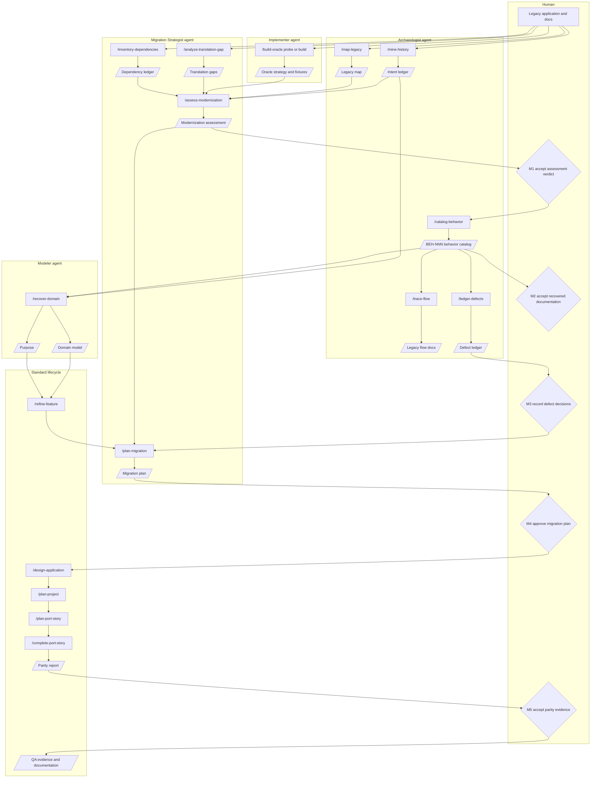

# Modernization Lane

Artifact-Driven Development can start from a raw idea, or it can start from an existing application that needs to be ported to a new language, framework, architecture, or operating model.

The main delivery workflow does not change much. Purpose, domain, requirements, design, stories, implementation, review, QA, documentation, and validation still provide the trace from intent to evidence. Modernization adds an upstream lane that examines the legacy system first, recovers what is knowable, grades the evidence, and decides how much parity can honestly be proved.

The rule is simple: the legacy application is evidence, not automatically the requirement. User documentation, release notes, executable behavior, source code, and commit history can disagree. The modernization lane preserves those disagreements until a human decision resolves them.

---

## High-Level Flow

The modernization lane has three phases:

1. **Assessment** decides whether the port is feasible and what conditions must be true before work starts.
2. **Recovery** turns legacy surfaces into evidence-graded purpose, domain, behavior, flow, and defect artifacts.
3. **Migration planning and port delivery** stages the work, plans port stories, implements parity-first, and verifies the new system against the legacy oracle.

---

## Modernization Gates

The greenfield workflow has nine human gates. Modernization adds five more gates around feasibility, provenance, defects, migration strategy, and parity evidence.

| Gate | What is being decided | What the human is looking for |
|---|---|---|
| M1. Accept assessment verdict | Is this modernization feasible enough to continue? | `go`, `go-with-conditions`, or `no-go`; a credible `RISK-NNN` register; the oracle tier; dependency and translation blockers; walking-skeleton feasibility. |
| M2. Accept recovered documentation | Is the recovered behavior and domain evidence strong enough to plan against? | `BEH-NNN` artifacts at `Ready for Requirements`, cited flows, recovered purpose/domain statements, and no unaccepted `E4 inferred` or `E5 unknown` items in planned scope. |
| M3. Record defect decisions | Should suspicious legacy behavior be reproduced, fixed now, or fixed later? | Each `DEF-NNN` has one decision: `reproduce-faithfully`, `fix-now`, or `fix-later`, with UAT impact and story/backlog linkage. |
| M4. Approve migration plan | Is this the right staging, cutover, and structure-fidelity strategy? | Chosen strategy (`strangler`, `phased-rewrite`, or `big-bang-parallel-run`), slice order, covered `BEH-NNN` / `Sn`, oracle evidence, ADR implications, rollback, and forecast confidence. |
| M5. Accept parity evidence | Did this port story match the accepted legacy expectation? | A parity report with `PARITY SUMMARY:`, no blocking `PAR-#` or `PROV-#` findings, and all mismatches reconciled through the defect ledger. |

These gates do not replace the greenfield gates. They add the decisions that only brownfield work needs.

---

## Phase 1: Assessment

Assessment answers: *Can this legacy application be migrated with credible evidence, and what would make the effort unsafe?*

`/assess-modernization` is the orchestrator. It runs or consumes the assessment-phase artifacts:

1. `/map-legacy`
2. `/mine-history`
3. `/inventory-dependencies`
4. `/analyze-translation-gap`
5. `/build-oracle probe`
6. `/assess-modernization`

The primary output is `docs/modernization/ASSESSMENT.md`.

### `/map-legacy`

- **Inputs.** Legacy repository path, source stack, target stack when known, and optional scope.
- **Agent.** Archaeologist.
- **Artifact.** `docs/modernization/legacy-map.md`.
- **Exit.** Languages, runtimes, build and deployment entrypoints, topology, entrypoints, data stores, interfaces, existing tests, and risk hotspots are mapped with evidence citations.

### `/mine-history`

- **Inputs.** Legacy repository, release notes, changelogs, tickets, user docs, and commit/tag history.
- **Agent.** Archaeologist.
- **Artifact.** `docs/modernization/intent-ledger.md`.
- **Exit.** Intent statements are captured as `INT-NNN` rows with evidence grade, confidence, downstream artifact, and any tensions between docs, history, code, and observed behavior.

### `/inventory-dependencies`

- **Inputs.** Legacy repository, source stack, target stack, architecture or platform constraints.
- **Agent.** Migration Strategist.
- **Artifact.** `docs/modernization/dependency-ledger.md`.
- **Exit.** Each dependency has support status, license concerns, target equivalent, substitution decision, impedance mismatch, ADR need, and blocker status.

### `/analyze-translation-gap`

- **Inputs.** Source stack, target stack, legacy map, dependency ledger.
- **Agent.** Migration Strategist.
- **Artifact.** `docs/modernization/translation-gaps.md`.
- **Exit.** `GAP-NNN` rows identify language, runtime, framework, data, numeric, build, deployment, and operational mismatches, plus whether they block skeleton planning.

### `/build-oracle probe`

- **Inputs.** Legacy repository, setup docs, behavior candidates, acceptance data.
- **Agent.** Implementer, with oracle-assessment constraints from the Migration Strategist.
- **Artifact.** `docs/modernization/oracle.md`.
- **Exit.** The legacy oracle is classified as `T1 executable`, `T2 recorded`, or `T3 documented-only`; containment, determinism, fixture, and tolerance concerns are recorded.

### `/assess-modernization`

- **Inputs.** The legacy map, intent ledger, dependency ledger, translation-gap analysis, oracle doc, target stack, and source docs.
- **Agent.** Migration Strategist.
- **Artifact.** `docs/modernization/ASSESSMENT.md`.
- **Human gate.** **M1: Accept assessment verdict.**
- **Exit.** A `go`, `go-with-conditions`, or `no-go` verdict with risks, blockers, oracle tier, and walking-skeleton feasibility.

---

## Phase 2: Recovery

Recovery answers: *What does the legacy system appear to do, how do we know, and what remains uncertain?*

`/document-legacy` is the orchestrator. It runs or consumes:

1. `/catalog-behavior`
2. `/trace-flow`
3. `/recover-domain`
4. `/ledger-defects`
5. `/document-legacy`

### `/catalog-behavior`

- **Inputs.** Legacy repository, user docs, release notes, support scripts, screenshots, observed runs, legacy map, intent ledger, oracle doc, defect ledger.
- **Agent.** Archaeologist.
- **Artifact.** `docs/modernization/behaviors/BEH-NNN-*.md`.
- **Human gate.** Supports **M2: Accept recovered documentation.**
- **Exit.** Each user-visible behavior has trigger, actors, inputs, outputs, side effects, rules, edge cases, draft Gherkin, citations, evidence grade, fixtures, and open questions.

### `/trace-flow`

- **Inputs.** A `BEH-NNN` behavior, entrypoint, screen, command, job, or source file path.
- **Agent.** Archaeologist.
- **Artifact.** Flow documents under `docs/modernization/flows/`.
- **Exit.** Sequence, state, step trace, ambiguous regions, and port implications are documented with evidence grades.

### `/recover-domain`

- **Inputs.** Behavior catalog, intent ledger, legacy map, user docs, release notes, defect ledger, existing purpose/domain artifacts when present.
- **Agent.** Modeler in legacy recovery mode.
- **Artifacts.** `docs/PURPOSE.md` and `docs/DOMAIN.md`.
- **Human gate.** Supports the standard purpose/domain approvals and **M2**.
- **Exit.** Purpose and domain model are recovered from evidence only. `E4 inferred` and `E5 unknown` claims remain open questions when they affect design or story planning.

### `/ledger-defects`

- **Inputs.** Bug reports, support notes, user decisions, behavior artifacts, oracle mismatches, suspicious legacy behavior.
- **Agent.** Archaeologist.
- **Artifact.** `docs/modernization/defect-ledger.md`.
- **Human gate.** **M3: Record defect decisions.**
- **Exit.** Each defect or mismatch has a `DEF-NNN` row and a decision: `reproduce-faithfully`, `fix-now`, or `fix-later`.

### `/document-legacy`

- **Inputs.** Accepted or conditionally accepted modernization assessment, recovery scope, user documentation.
- **Agent.** Orchestrates Archaeologist and Modeler phases.
- **Artifacts.** Behavior catalog, flow docs, purpose, domain model, defect ledger.
- **Human gate.** **M2** and **M3**.
- **Exit.** Recovered artifacts are ready to feed `/refine-feature` and `/plan-migration`.

---

## Phase 3: Migration Planning And Port Delivery

Planning answers: *How should the migration be sliced, what must stay faithful, what can be changed, and how will parity be proved?*

### `/plan-migration`

- **Inputs.** Accepted assessment, recovered purpose/domain, behavior catalog, refined requirements, translation gaps, dependency ledger, oracle doc, defect ledger, design doc, target stack.
- **Agent.** Migration Strategist.
- **Artifact.** `docs/modernization/migration-plan.md`, plus ADRs for binding decisions.
- **Human gate.** **M4: Approve migration plan.**
- **Exit.** A staging strategy, slice plan, structure-fidelity choices, cutover/rollback plan, parity strategy, and forecast/recalibration triggers.

### `/plan-port-story`

- **Inputs.** Story ID, linked `BEH-NNN` behaviors, linked `REQ-NNN` / `Sn` scenarios, migration-plan slice, oracle doc, defect ledger, translation gaps, purpose, domain model, ADRs, design doc.
- **Agent.** Architect.
- **Artifact.** `docs/features/{STORY-ID}-{slug}.md` using the port-story template.
- **Human gate.** Standard **Gate 7: Approve story spec**, with modernization readiness checks.
- **Exit.** An implementation-ready port story with `### 1b. Legacy source touchpoints`, `Phase P`, `## 8b. Parity Plan`, a `Covers BEH` test-plan column, and `Z8`.

### `/complete-port-story`

- **Inputs.** Approved port story, oracle doc, defect ledger, parity plan, linked artifacts, and no unresolved `E4` / `E5` behavior in covered scope without a recorded decision.
- **Agents.** Implementer, Auditor, QA, Docs-PM.
- **Artifacts.** Code, tests, story review, parity report, QA matrix, documentation updates, validation result.
- **Human gate.** **M5: Accept parity evidence**, followed by the normal **Gate 8** QA evidence and **Gate 9** documentation approval.
- **Exit.** Port story completed with parity evidence, QA evidence, documentation, and completion metadata.

### `/verify-parity`

- **Inputs.** Port story `Phase P`, `## 8b. Parity Plan`, linked `BEH-NNN`, oracle refs, tolerances, defect decisions, oracle doc, behavior artifacts, defect ledger.
- **Agent.** QA.
- **Artifact.** `docs/modernization/parity/{STORY-ID}-parity.md`.
- **Human gate.** Supports **M5**.
- **Exit.** A parity report whose first non-comment line is `PARITY SUMMARY:` and whose matrix records `PASS`, `FAIL`, or `BLOCKED` for the story's parity claims.

---

## Evidence Grades

Modernization evidence has two questions:

1. **What proves the recovered fact?**
2. **Is that proof strong enough to plan, implement, or claim parity?**

The default evidence grades are:

| Grade | Meaning | Planning consequence |
|---|---|---|
| `E1 verified` | Observed by executing the legacy system or oracle. | Strongest basis for parity and acceptance data. |
| `E2 documented` | Stated in user documentation, release notes, help text, or accepted support material. | Strong basis for requirements; still reconcile against executable behavior when possible. |
| `E3 code-derived` | Read from legacy source, configuration, schema, or tests. | Useful, but not automatically product intent. |
| `E4 inferred` | Deduced from commit history, names, structure, or analogy. | Blocks implementation-ready port planning unless accepted by the user. |
| `E5 unknown` | Missing or unresolved. | Blocks affected scope until resolved, deferred, or explicitly accepted as risk. |

Every recovered behavior, field, invariant, flow, and risk carries a grade and citation. The grade is not decorative metadata; it controls readiness.

---

## Oracle Tiers

Parity is only as strong as the oracle behind it.

| Tier | Meaning | What can be claimed |
|---|---|---|
| `T1 executable` | The legacy system can be run repeatedly in a controlled environment. | Repeated legacy-vs-new comparison is possible. |
| `T2 recorded` | Legacy behavior can be frozen into fixture outputs, but not repeated cheaply. | Parity can be checked against a fixed corpus, not an independently rerunnable system. |
| `T3 documented-only` | The legacy system cannot be run; expected behavior comes from documentation or user-supplied acceptance data. | Parity is limited to documented expectations; it is not independently provable. |

The workflow forbids claiming parity confidence above the oracle tier. A `T3 documented-only` project can still be migrated, but the artifacts must say that parity depends on documented or user-accepted expectations.

---

## Defect Decisions

Legacy defects are not automatically fixed during a port. A behavior that looks wrong may be:

- A bug users depend on.
- A bug users want fixed now.
- A bug users want preserved for cutover and fixed later.
- A misunderstanding caused by weak evidence.

The defect ledger records the decision before implementation:

| Decision | Meaning |
|---|---|
| `reproduce-faithfully` | The port should match the legacy behavior, even if it looks wrong. |
| `fix-now` | The port should intentionally change the behavior and test the corrected expectation. |
| `fix-later` | The port should preserve legacy behavior for now and create or link deferred work. |

An agent may discover suspicious behavior, but it does not decide which category applies. That decision belongs to the human gate.

---

## Where The Lane Rejoins The Standard Lifecycle

The modernization lane is an alternate entry point, not a different delivery system.

- `/recover-domain` satisfies the purpose and domain-model work from recovered evidence rather than from a raw idea.
- `/refine-feature`, `/design-application`, and `/plan-project` keep their normal responsibilities.
- The walking skeleton remains preferred when feasible. If `ASSESSMENT.md` says no useful skeleton can run yet, the first port slice may be a black-box proof slice instead.
- `/plan-port-story` replaces `/plan-story` for migration slices. It adds legacy touchpoints, parity criteria, behavior coverage, and oracle linkage.
- `/complete-port-story` is the normal implementation/review/QA/document/validate tail with `/verify-parity` inserted between review and QA.
- Standard Gate 8 and Gate 9 remain unchanged: QA evidence and documentation still close the story.

In short: modernization changes how intent is recovered and how parity is proved. It does not remove the artifact trail from purpose to shipped evidence.

---

## Read Next

- [PROCESS.md](PROCESS.md) - the standard story lifecycle and nine human gates.
- [BUILDING-BLOCKS.md](BUILDING-BLOCKS.md) - agents, commands, templates, artifacts, evidence, and gates.
- [ROLES.md](ROLES.md) - what each agent owns and how work hands off.
- [TRACEABILITY.md](TRACEABILITY.md) - how recovered legacy evidence links forward to story evidence.
- [SETUP.md](SETUP.md) - how to install the workflow assets.
