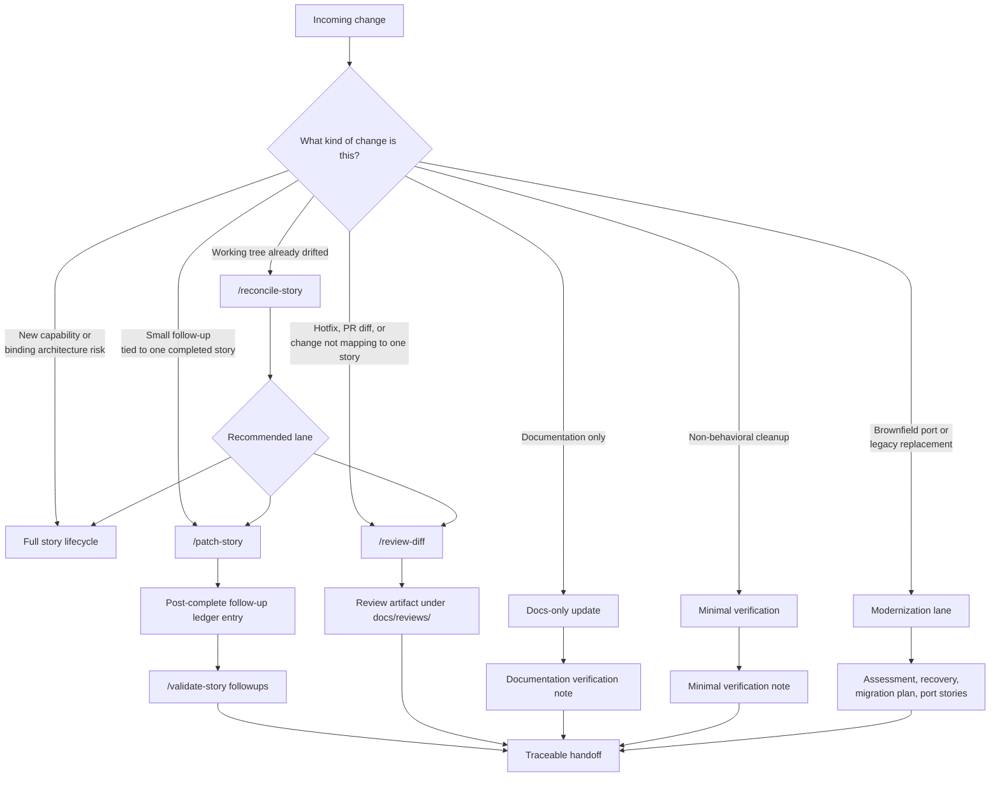

# Post-Story Work

Not every change should reopen the full story lifecycle. A two-word copy fix, a hotfix, a documentation typo, and a binding architectural change cannot all carry the same ceremony — and they do not need to.

This document describes the lanes that exist *after* a story is complete, the rules for choosing between them, and the conditions that force a change back into the full story lifecycle.

For the full story lifecycle itself, see [PROCESS.md](PROCESS.md).

---

## Choosing a lane

Every change that arrives after a story is complete should be classified before any work is done. The goal is the lightest lane that preserves traceability.

The fast path is `/patch-story` when the change clearly belongs to one completed story. The slow path is the full story lifecycle when the change crosses a binding constraint. Most real changes are in the middle and need the auditor to classify them.

---

## Change classes

Before choosing a lane, classify the change (per the standing change-routing rules agents inherit):

| Class | When to use | Lane |
|---|---|---|
| `story-followup` | Small behavior fix, polish, copy, or local refinement tied to one completed story; no binding-constraint change | `/patch-story` |
| `trivial-code` | Non-behavioral typo, formatting, comment, or mechanical cleanup | `/patch-story` (or minimal verification + `/review-diff` when risk is unclear) |
| `docs-only` | Documentation-only update | `/patch-story` or direct doc edit; `/review-diff` when setup, API contracts, or ops behavior are affected |
| `hotfix-diff` | Unplanned fix or branch diff that does not map cleanly to one story | `/review-diff` |
| `full-story` | New capability, binding constraint change, port/adapter change, API contract change, or work that invalidates original acceptance criteria | Full lifecycle (`/plan-story` → …) |
| `modernization-port` | Brownfield modernization, language/framework port, or replacement of a legacy application | Modernization lane (`/assess-modernization` → `/document-legacy` → `/plan-migration` → `/plan-port-story` → `/complete-port-story`) |

---

## `/patch-story`

Use `/patch-story` when the change clearly belongs to one completed story and is small in scope: polish, copy adjustment, targeted bug fix, local debugging discovery, focused test repair, or documentation correction. Do **not** use it for new capabilities, binding constraint changes, adapter/port changes, API contract changes, persistence/auth changes, broad refactors, or changes that invalidate original acceptance criteria — route those to `/plan-story` or `/review-diff` instead.

- **Preserves.** The original acceptance criteria text and the original `Status: Complete`. The story is not reopened; completed criteria are not unchecked. If the follow-up exposes that a completed criterion was wrong, stop and emit a **Conflict report** instead of patching.
- **Adds.** One row per follow-up to `## 11. Post-complete Follow-up Ledger` with: sequential ID (`F1`, `F2`, …), date, change class (`story-followup`, `trivial-code`, or `docs-only`), intent, files touched, verification command or inspection proof, **Change ref** (commit SHA, PR URL, or `uncommitted` / `TBD`), **Review ref** (`none`, or the path to `docs/reviews/...` when `/review-diff` was run for this follow-up), docs impact, and AC impact (usually `none`).
- **Verifies.** With targeted tests appropriate to the change, not the full original test plan. For behavior changes, preserve red-first at the smallest reasonable scale; for `trivial-code` and `docs-only`, record the explicit exception in the summary.
- **Followed by.** `/validate-story {STORY-ID} followups` to confirm the ledger entry is structurally consistent before finishing.

Run `/review-diff` only when the change is not obviously local, affects security/reliability/API behavior, touches test infrastructure, or the risk classification is unclear. Otherwise the ledger entry plus targeted verification is sufficient.

Use this lane often. Most real follow-up work is small, and forcing every small change through the full lifecycle is what turns a workflow into ceremony.

---

## `/reconcile-story`

Use `/reconcile-story` when the working tree already has drift — uncommitted changes, a branch that has accumulated work, or a state where it is not obvious which story (if any) the changes belong to. This command does **not** assume the drift is safe; it maps changed files to a workflow lane first.

**Inputs.** Optional story ID; optional base ref for diff inspection (defaults to the project's main branch).

The reconciler:

1. Inspects `git status`, `git diff --stat`, and `git diff --name-status <base-ref>...HEAD` (including untracked files).
2. Maps changed files to a completed story — from the provided story ID, or by comparing paths against story Section 7 file touchpoints and recent completion metadata. Stops and asks when the match is ambiguous.
3. Classifies each changed file or coherent group using the change classes above (`story-followup`, `trivial-code`, `docs-only`, `hotfix-diff`, `full-story`).
4. Checks escalation triggers: binding constraints, ADRs, ports/adapters, persistence/auth, API contracts, broad refactors, or changed acceptance-criterion semantics. When any trigger is present, outputs a **Route escalation** note and recommends `/review-diff` or a new story — no ledger entry.
5. For drift that cleanly belongs to one completed story and stays inside `story-followup`, `trivial-code`, or `docs-only`: verifies the story is `Complete`, identifies minimal verification, resolves **Change ref** from `git rev-parse HEAD` when committed (otherwise `uncommitted` or `TBD`), and appends one row per coherent follow-up to the Post-complete Follow-up Ledger (including **Review ref** as `none` unless `/review-diff` already produced an artifact).
6. When verification or commit is still pending, leaves `Verification` or `Change ref` as `TBD` and names the exact command or inspection needed.
7. When ledger rows are added, runs `/validate-story {STORY-ID} followups` and includes the result in the summary.
8. When behavioral code changed without matching tests, recommends `/patch-story {STORY-ID}` to add or tighten the focused test before considering the drift reconciled.

**Output.** A Drift Reconciliation Summary: story ID (or `unassigned`), changed files grouped by classification, ledger entries added or recommended, verification still needed, validation result when a ledger entry was added, route escalations, and recommended next command (`/patch-story`, `/review-diff`, `/plan-story`, or none).

---

## `/review-diff`

Use `/review-diff` for hotfixes, PR-style reviews, branch comparisons, or any work that does not map cleanly to one completed story. It runs the same focused review rubric as `/review-story` — reliability, security, API contracts, test coverage — but uses the **git diff** as the scope source instead of a story's Section 7 file list.

**Inputs.**

- **Base ref** — what to diff against. Defaults to the project's main branch (`main` or `master`, auto-detected). Any reachable ref works (`origin/main`, a commit SHA, a tag).
- **Target ref** (optional) — defaults to `HEAD`.
- **Story ID** (optional) — when the diff is believed to be a post-complete follow-up. The auditor reads that story's Completion Metadata and Post-complete Follow-up Ledger for context but still reviews the diff as the source of truth.

**Behavior.**

1. Resolves scope via `git diff <base-ref>...<target-ref>` and commit context via `git log`.
2. Applies the same per-category rubric as `/review-story`: new behavior needs a test in the diff; modified adapters need a non-mock integration test in the diff or already in the repo and still passing.
3. When a story ID is provided, checks whether the diff matches one or more ledger rows (including `Change ref` and `Review ref`). Missing or stale ledger entries are reported as documentation drift. For post-complete follow-ups, the ledger row's `Review ref` should point to the written review artifact.
4. Writes findings to `docs/reviews/diff-{base-ref-slug}--{target-ref-slug}-{YYYYMMDD}.md` using the story-review template. The **first line** is a grep-friendly `REVIEW SUMMARY:`; `Gate result` is `Block` on any `high`/`critical` finding, otherwise `Pass`.
5. Does not modify the diffed code.

Out-of-plan detection does not apply (there is no story plan); all changed files are in scope by definition. For `hotfix-diff` work, this is the default quality gate before handoff. For `story-followup` work, prefer `/patch-story` first when the change clearly belongs to one completed story; use `/review-diff` when risk is unclear or the diff spans multiple stories.

**Examples.** `/review-diff`, `/review-diff origin/main`, `/review-diff v1.4.0`, `/review-diff origin/main feature/oto-9`, `/review-diff origin/main HEAD OTO-2`.

---

## `/validate-story followups`

After `/patch-story` or `/reconcile-story` appends one or more Post-complete Follow-up Ledger rows, run `/validate-story {STORY-ID} followups` before considering the follow-up handoff complete.

This mode verifies each ledger row beyond the template example has: sequential ID (`F1`, `F2`, …), date, an allowed change class (`story-followup`, `trivial-code`, or `docs-only`), files touched, verification command or inspection proof (or `TBD` plus a required next command), **Change ref** (commit SHA, PR URL, `uncommitted`, or justified `TBD`), **Review ref** (`none` or a path under `docs/reviews/`), and an AC impact field. Output is a Story Validation Matrix with `PASS` / `FAIL` / `BLOCKED` per check.

See [PROCESS.md](PROCESS.md) for the full `/validate-story` mode table (`ready`, `complete`, `followups`, and default).

---

## Audits

Audits are periodic health checks, not part of story completion.

- **`/map-repo`** writes a system map into `audit-findings.md` to establish what currently exists.
- **`/audit-all`** runs the full audit pipeline across categories and triages findings.
- **`/triage-audit-findings`** reconciles fix-now versus defer for the findings.
- **Category audits** target one concern each: `/audit-tooling`, `/audit-reliability`, `/audit-db`, `/audit-api-contracts`, `/audit-security`, `/audit-performance`, `/audit-test-coverage`.

Audit findings that require code changes are then routed into one of the lanes above — usually a new story for anything binding, or `/patch-story` for small repairs tied to a completed story.

Audits do not run as part of normal story completion. They run on a cadence the team chooses, or when a specific risk is suspected.

---

## When to escalate back to the full lifecycle

A follow-up must escalate back to the full story lifecycle when it would:

- Touch a binding constraint named by an architecture decision record.
- Change a port or adapter contract.
- Modify an API contract that is consumed elsewhere.
- Change auth, persistence location, transport, embedding stack, or a named dependency.
- Invalidate the original acceptance criteria of the story it appears to belong to.

If any of these is true, `/patch-story` is the wrong lane. The change is a new story, even if the surface area looks small. The signal is the binding decision being touched, not the size of the diff.

When in doubt, run `/reconcile-story` first and let the auditor recommend the lane.

---

## Read next

- [PROCESS.md](PROCESS.md) — the full story lifecycle, for reference when escalation is required.
- [BUILDING-BLOCKS.md](BUILDING-BLOCKS.md) — the composition matrix; the post-story commands use the same agents and templates as the main lifecycle.
- [WHY-IT-WORKS.md](WHY-IT-WORKS.md) — why these lanes exist instead of one universal process.
