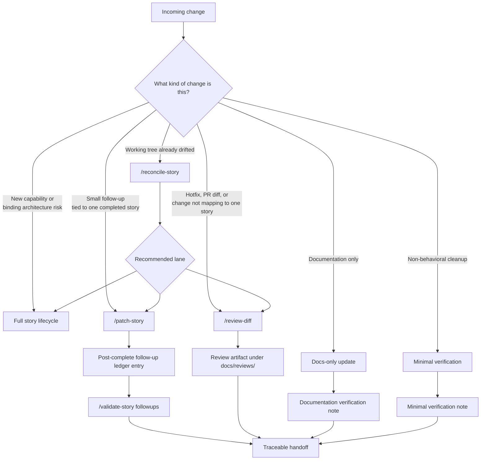

# Post-Story Work

Not every change should reopen the full story lifecycle. A two-word copy fix, a hotfix, a documentation typo, and a binding architectural change cannot all carry the same ceremony — and they do not need to.

This document describes the lanes that exist *after* a story is complete, the rules for choosing between them, and the conditions that force a change back into the full story lifecycle.

For the full story lifecycle itself, see [PROCESS.md](PROCESS.md).

---

## Choosing a lane

Every change that arrives after a story is complete should be classified before any work is done. The goal is the lightest lane that preserves traceability.

The fast path is `/patch-story` when the change clearly belongs to one completed story. The slow path is the full story lifecycle when the change crosses a binding constraint. Most real changes are in the middle and need the auditor to classify them.

---

## `/patch-story`

Use `/patch-story` when the change clearly belongs to one completed story and is small in scope: polish, copy adjustment, targeted bug fix, local debugging discovery, focused test repair, or documentation correction.

- **Preserves.** The original acceptance criteria and the original `Status: Complete`. The story is not reopened.
- **Adds.** A row to the story's Post-complete Follow-up Ledger with intent, files touched, verification performed, documentation impact, and any impact on the original acceptance criteria (usually `none`).
- **Verifies.** With targeted tests appropriate to the change, not the full original test plan.
- **Followed by.** `/validate-story followups` to confirm the ledger entry is consistent.

Use this lane often. Most real follow-up work is small, and forcing every small change through the full lifecycle is what turns a workflow into ceremony.

---

## `/reconcile-story`

Use `/reconcile-story` when the working tree already has drift — uncommitted changes, a branch that has accumulated work, or a state where it is not obvious which story (if any) the changes belong to.

The auditor:

1. Maps changed files back to a completed story when possible.
2. Recommends a lane: a ledger entry, `/patch-story`, `/review-diff`, or escalation to a new story.
3. Names the binding constraints that would force escalation if they were touched.

The output is a classification, not a fix. The recommended lane is then run normally.

---

## `/review-diff`

Use `/review-diff` for hotfixes, PR-style reviews, branch comparisons, or any work that does not map cleanly to one completed story.

The auditor reviews the diff itself as the source of scope and writes a review artifact under `docs/reviews/`. The review uses the same template as `/review-story`, so the output is consistent regardless of whether the change originated in a story.

This lane exists because not every real change in a codebase comes from a planned story. Hotfixes happen. External contributors send PRs. The diff still needs a reviewable artifact.

---

## Audits

Audits are periodic health checks, not part of story completion.

- **`/map-repo`** writes a system map into `audit-findings.md` to establish what currently exists.
- **`/audit-all`** runs the full audit pipeline across categories and triages findings.
- **`/triage-audit-findings`** reconciles fix-now versus defer for the findings.
- **Category audits** target one concern each: `/audit-tooling`, `/audit-reliability`, `/audit-db`, `/audit-api-contracts`, `/audit-security`, `/audit-performance`, `/audit-test-coverage`.

Audit findings that require code changes are then routed into one of the lanes above — usually a new story for anything binding, or `/patch-story` for small repairs tied to a completed story.

Audits do not run as part of normal story completion. They run on a cadence the team chooses, or when a specific risk is suspected.

---

## When to escalate back to the full lifecycle

A follow-up must escalate back to the full story lifecycle when it would:

- Touch a binding constraint named by an ADR.
- Change a port or adapter contract.
- Modify an API contract that is consumed elsewhere.
- Change auth, persistence location, transport, embedding stack, or a named dependency.
- Invalidate the original acceptance criteria of the story it appears to belong to.

If any of these is true, `/patch-story` is the wrong lane. The change is a new story, even if the surface area looks small. The signal is the binding decision being touched, not the size of the diff.

When in doubt, run `/reconcile-story` first and let the auditor recommend the lane.

---

## Read next

- [PROCESS.md](PROCESS.md) — the full story lifecycle, for reference when escalation is required.
- [BUILDING-BLOCKS.md](BUILDING-BLOCKS.md) — the composition matrix; the post-story commands use the same agents and templates as the main lifecycle.
- [WHY-IT-WORKS.md](WHY-IT-WORKS.md) — why these lanes exist instead of one universal process.
