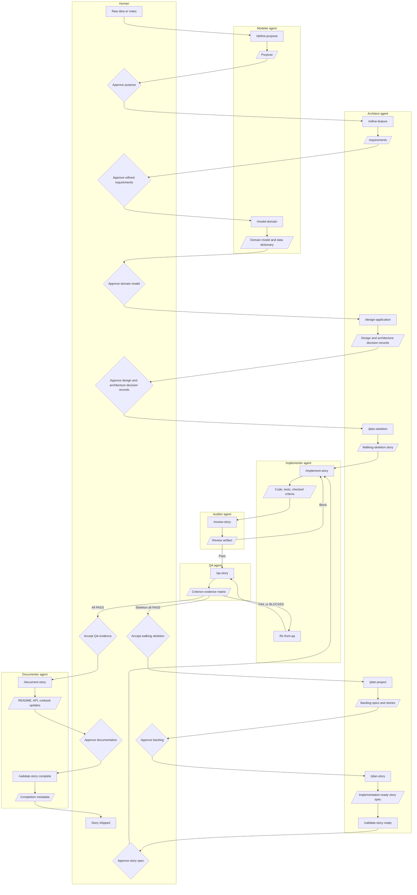

# The Process

This document walks through the full story lifecycle from a raw idea to a shipped story. It expands the swimlane diagram in the [README](README.md) and names every human gate.

The lifecycle separates **agent actions** (commands run by an agent) from **artifacts** (durable outputs that become context for the next step). The human owns the decisions that bind work between steps.

For everything that happens *after* a story is complete — small follow-ups, hotfixes, audits, drift reconciliation — see [POST-STORY.md](POST-STORY.md).

---

## The full lifecycle

The happy path can be run one command at a time. The skeleton and story tails — implement, review, QA, document, validate — can also be orchestrated with `/complete-story` after `/plan-skeleton` or `/plan-story` has produced an approved story document.

---

## The nine human gates

The agents do the work. The human makes the decisions that bind it.

| Gate | What is being decided | What the human is looking for |
|---|---|---|
| 1. Approve purpose | Is this the right product thesis and trade-off rule? | A concise thesis, job, north-star outcome, anti-thesis, and success signals that can resolve later trade-offs. |
| 2. Approve refined requirements | Is this the right problem, stated clearly enough to model and design against? | Goals, non-goals, personas, constraints, and Gherkin scenarios that match the approved purpose. Open questions resolved or explicitly deferred. |
| 3. Approve domain model | Is the application's meaning explicit enough to design and review against? | Ubiquitous language, data dictionary, entities, relationships, invariants, lifecycles, and consistency boundaries. Open modeling questions resolved or explicitly deferred. |
| 4. Approve design and architecture decision records | Is this the right technical shape, with the binding decisions captured? | Architecture, stack, API contract, environment, and any architecture decision records needed for persistence, transport, auth, named dependencies, or integration model, all aligned to purpose and domain boundaries. |
| 5. Accept walking skeleton | Does the thinnest running slice prove the purpose, model, architecture, and boundaries before feature planning? | A demoable end-to-end path through the real composition root and real or hermetic-trivial adapters, plus any "not what I meant" deltas routed back into requirements or domain artifacts. |
| 6. Approve backlog | Are the epics and stories the right slices, in the right order? | Epics that map to the design and domain boundaries, stories sized for one implementer pass, and no orphaned or duplicated work. |
| 7. Approve story spec | Is this story implementation-ready? | Linked purpose/domain/requirements/architecture decision records, domain touchpoints, file touchpoints, acceptance criteria, test plan rows, implementation order, binding constraints. |
| 8. Accept QA evidence | Did the implementation actually satisfy the story? | Every acceptance criterion marked PASS in the QA matrix with executable evidence. Any FAIL or BLOCKED resolved. |
| 9. Approve documentation | Do the project's documentation surfaces match what was shipped? | README, API docs, OpenAPI specs, runbooks, setup, and environment docs updated for any surface the story changed. |

A gate that is rubber-stamped is a gate that has stopped doing its job. Each one exists because skipping it has been observed to cost more later.

---

## Stage by stage

Each stage names its primary inputs, the agent action, the artifact produced, the human gate that follows, and the exit condition.

### 0. `/init-project` (optional)

- **Inputs.** A new repository.
- **Agent.** Architect (or run by the human directly).
- **Artifact.** Scaffolded `README.md` and configured documentation directories using the README template. Purpose and domain files are not filled during mechanical setup.
- **Human gate.** None — this is mechanical setup.
- **Exit.** A repository ready to accept refined requirements.

Skip this stage when working in an existing project that already has a README and `docs/` layout.

### 1. `/define-purpose`

- **Inputs.** Raw idea, notes, transcripts, product brief, or conversation.
- **Agent.** Modeler.
- **Artifact.** `docs/PURPOSE.md`. The modeler captures the thesis, job, north-star outcome, trade-off rule, anti-thesis, success signals, and open purpose questions.
- **Human gate.** **Gate 1: Approve purpose.**
- **Exit.** Approved purpose that requirements, modeling, design, stories, and reviews can use as a decision lens.

### 2. `/refine-feature`

- **Inputs.** Approved purpose plus raw notes, tickets, transcripts, pasted requirements, or a conversation.
- **Agent.** Architect.
- **Artifact.** `docs/requirements/REQ-NNN-*.md`. The architect asks clarifying questions, records resolved and open questions, and writes Gherkin scenarios (`S1`, `S2`, `S3`...) that later stages use as trace points.
- **Human gate.** **Gate 2: Approve refined requirements.**
- **Exit.** Approved requirements that the domain model and design steps can consume without guessing.

### 3. `/model-domain`

- **Inputs.** Approved purpose and refined requirements.
- **Agent.** Modeler.
- **Artifact.** `docs/DOMAIN.md`. The modeler captures ubiquitous language, data dictionary, entities, relationships, invariants, lifecycles, domain events, and aggregate / consistency boundaries.
- **Human gate.** **Gate 3: Approve domain model.**
- **Exit.** Approved model that design, stories, code, and model-fidelity review can use as the canonical language and meaning.

### 4. `/design-application`

- **Inputs.** Approved purpose, domain model, and refined requirements.
- **Agent.** Architect.
- **Artifact.** Updated project `README` design section (architecture, stack, API contract, environment variables, setup, UI structure) plus any architecture decision records needed for binding technical decisions.
- **Human gate.** **Gate 4: Approve design and architecture decision records.**
- **Exit.** An approved design that the walking skeleton can prove before backlog planning.

If the design would silently commit to a persistence choice, transport, auth model, embedding stack, or named dependency, the architect writes an architecture decision record before later steps depend on it.

### 5. `/plan-skeleton`

- **Inputs.** Approved purpose, domain model, requirements, design, and architecture decision records.
- **Agent.** Architect.
- **Artifact.** `docs/features/SK-1-*.md` (or the configured skeleton story ID) using the walking-skeleton template. The skeleton story plans one thin end-to-end path through the real composition root and every planned boundary in scope.
- **Validation / execution.** Run the skeleton through the normal tail: `/implement-story`, `/review-story`, `/qa-story`, and `/document-story`.
- **Human gate.** **Gate 5: Accept walking skeleton.**
- **Exit.** A demoable running slice. Any "that is not what I meant" feedback is routed back to `/refine-feature` or `/model-domain`; if the slice holds, backlog planning begins.

### 6. `/plan-project`

- **Inputs.** Approved purpose, domain model, design, requirements, and accepted walking skeleton.
- **Agent.** Architect.
- **Artifact.** Backlog epics and story rows in the project README. Updates the requirements log and backlog only; preserves completed or in-progress work so existing story documents do not become orphaned.
- **Human gate.** **Gate 6: Approve backlog.**
- **Exit.** A backlog whose stories can each be planned individually.

### 7. `/plan-story`

- **Inputs.** Approved backlog, purpose, domain model, refined requirements, design, architecture decision records.
- **Agent.** Architect.
- **Artifact.** `docs/features/{STORY-ID}-*.md` — the implementer's spec. Includes domain model touchpoints, linked architecture decision records, Definition of Ready, binding constraints, ports and adapters (Section 4b), API and frontend flow notes, file touchpoints, acceptance criteria (including Phase Y binding and Phase Z quality gates), test plan rows with **Covers AC** and **Covers Sn** columns, implementation order, completion metadata, and a post-complete follow-up ledger.
- **Validation.** `/validate-story ready` confirms the story spec matches the user-story template contract: required sections present, domain touchpoints listed, every acceptance criterion has an `Evidence:` line, every AC ID appears in the test plan, Gherkin `Sn` IDs are mapped (or explicitly out of scope), the model-fidelity `Z7` gate is present, and when Section 4b lists ports or adapters, each port has a `contract` test row, each adapter has an `integration` test row, and Phase Y contains `(binding)` criteria citing non-mock evidence.
- **Human gate.** **Gate 7: Approve story spec.**
- **Exit.** An approved, validated story document.

When a story touches domain meaning, Section 1a must name every purpose/domain section, term, entity, field, invariant, lifecycle, or boundary in play. When a story touches an integration boundary, Section 4b must list every port and adapter, Section 8a must plan a `contract` test row per port and an `integration` test row per adapter (against the real backing service or fixture — no mock of the boundary the adapter owns), and Phase Y must contain `(binding)` criteria citing the integration tests. Every Gherkin `Sn` ID from the linked requirements that this story implements must appear in the test plan's **Covers Sn** column.

### 8. `/implement-story`

- **Inputs.** Approved story spec and linked architecture decision records.
- **Agent.** Implementer.
- **Artifact.** Code changes, tests, and an updated story document with criteria checked off as they pass. Status moves `Open` → `In Progress` → `Complete`.
- **Human gate.** None at this step. The next gate is QA evidence; the auditor and QA agents run before the human is asked to accept anything.
- **Exit.** All acceptance criteria checked off, ready for review.

The implementer follows the planned implementation order, uses red-first tests by default for each acceptance criterion, and does not silently reinterpret requirements or substitute binding decisions. If the plan turns out to be wrong, the workflow escalates back to architect rather than hiding the change in code.

### 9. `/review-story`

- **Inputs.** Story document, configured purpose and domain artifacts, and the changed surface.
- **Agent.** Auditor.
- **Artifact.** `docs/features/{STORY-ID}-review.md`, with a machine-readable `REVIEW SUMMARY:` line and a `Pass` or `Block` gate result.
- **Human gate.** None directly. A `Block` returns to the implementer with required actions. A `Pass` allows the story to move to QA.
- **Exit.** Review artifact with a `Pass` result.

Review focuses on the changed surface: reliability, security, API contracts, test coverage, and model fidelity. It is not a substitute for QA, and it is not a substitute for the human's QA-evidence gate.

### 10. `/qa-story`

- **Inputs.** Story acceptance criteria and executable evidence.
- **Agent.** QA.
- **Artifact.** A criterion evidence matrix with `PASS`, `FAIL`, or `BLOCKED` for every criterion, citing the test path or other evidence that proves the result.
- **Human gate.** **Gate 8: Accept QA evidence** — only after the matrix is all PASS.
- **Exit.** Accepted QA matrix.

Any `FAIL` or `BLOCKED` loops through `/fix-from-qa`, where the implementer fixes only the failed or blocked criteria and returns to QA. QA does not infer completion from code alone.

### 11. `/document-story`

- **Inputs.** Completed story, accepted QA matrix, completion metadata, follow-up ledger.
- **Agent.** Documenter.
- **Artifact.** Updated README, API docs, OpenAPI specs, runbooks, setup instructions, or environment docs — only where the story changed those surfaces.
- **Validation.** `/validate-story complete` checks that completion metadata, evidence, and follow-up consistency match the story.
- **Human gate.** **Gate 9: Approve documentation.**
- **Exit.** Approved documentation updates and recorded completion metadata.

Documentation updates are driven by the story source of truth. The documenter does not update unrelated documentation just because it is nearby.

### `/validate-story` (cross-cutting)

`/validate-story` checks that a story document is structurally consistent with the user-story template and that its evidence, completion metadata, and follow-up ledger are coherent. Run it as a lightweight quality gate after planning, before implementation, after completion, or after post-story commands append ledger rows.

| Mode | When to run | What it checks |
|---|---|---|
| `ready` | After `/plan-story`, before Gate 7 approval | Required sections, domain touchpoints, AC `Evidence:` lines, test plan coverage of every AC ID, model-fidelity `Z7`, port/adapter contract and integration test rows, Phase Y `(binding)` criteria |
| `complete` | After `/document-story`, before Gate 9 approval | All criteria checked, Completion Metadata filled, review summary starts with `REVIEW SUMMARY:` and includes model-fidelity counts, QA result shows all PASS |
| `followups` | After `/patch-story` or `/reconcile-story` appends ledger rows | Each follow-up row has sequential ID, date, allowed change class, files touched, verification (or justified `TBD`), **Change ref**, **Review ref**, and AC impact |
| *(default)* | Any time | All checks applicable to the story's current status |

Output is a Story Validation Matrix with `PASS` / `FAIL` / `BLOCKED` per check.

---

## What each stage produces

| Stage | Primary input | Primary output | Human gate |
|---|---|---|---|
| `/init-project` | Empty repo | Scaffolded README and `docs/` layout | — |
| `/define-purpose` | Raw idea or notes | `docs/PURPOSE.md` | Gate 1 |
| `/refine-feature` | Purpose + raw notes | `docs/requirements/REQ-NNN-*.md` | Gate 2 |
| `/model-domain` | Purpose + requirements | `docs/DOMAIN.md` | Gate 3 |
| `/design-application` | Purpose, domain model, refined requirements | Design section and architecture decision records | Gate 4 |
| `/plan-skeleton` | Purpose, domain model, design, architecture decision records | Walking-skeleton story | Gate 5 after implementation/review/QA |
| `/plan-project` | Design, requirements, accepted skeleton | Backlog epics and story rows | Gate 6 |
| `/plan-story` | Purpose, domain model, requirements, design, architecture decision records, backlog | `docs/features/{STORY-ID}-*.md` | Gate 7 |
| `/validate-story ready` | Story document | Readiness validation (sections, domain touchpoints, AC evidence, test plan, model-fidelity gate, ports/adapters) | (supports Gate 7) |
| `/validate-story followups` | Completed story with ledger rows | Follow-up ledger validation (`Change ref`, `Review ref`, change class) | (supports post-story lanes) |
| `/implement-story` | Story spec and architecture decision records | Code, tests, updated story status | — |
| `/review-story` | Story, purpose/domain artifacts, and changed surface | Review artifact (`Pass`/`Block`) including model fidelity | — |
| `/qa-story` | Story criteria and evidence | Criterion evidence matrix | Gate 8 |
| `/fix-from-qa` | Failed or blocked criteria | Targeted fix | — |
| `/document-story` | Completed story, metadata, ledger | Documentation updates | Gate 9 |
| `/validate-story complete` | Completed story | Completion validation | (supports Gate 9) |

---

## Read next

- [WORKFLOW-EXAMPLE.md](WORKFLOW-EXAMPLE.md) — the same lifecycle shown through one completed story in the sample application.
- [BUILDING-BLOCKS.md](BUILDING-BLOCKS.md) — what agents, commands, templates, artifacts, evidence, and gates each do, and how they compose.
- [ROLES.md](ROLES.md) — what each agent owns and how work hands off between them.
- [TRACEABILITY.md](TRACEABILITY.md) — how purpose, domain model, requirements, architecture decision records, and design flow through the story spec into evidence.
- [POST-STORY.md](POST-STORY.md) — small follow-ups, hotfixes, audits, drift reconciliation, escalation.
