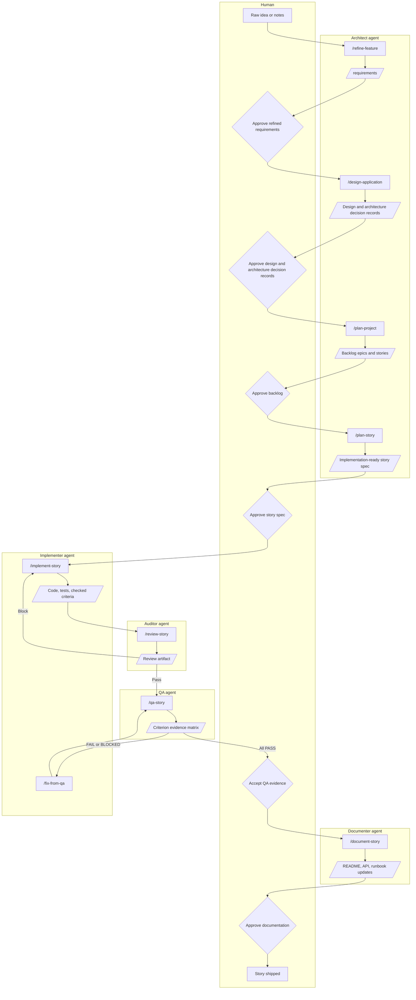

# Artifact-Driven Development

An artifact-driven methodology for AI-assisted software delivery.

The model is not asked to figure everything out. It operates inside a controlled workflow where durable artifacts define intent, agent roles separate concerns, commands and templates shape output, and evidence gates validate completion.

---

## The problem with AI-assisted development today

AI coding tools are often sold as a productivity multiplier. In practice, the experience is more complicated:

- Vibe coding produces inconsistent and messy code. The same request, asked twice, returns two different shapes.
- Any code the model writes still requires a line-by-line review. Trust is not transferable.
- Getting a satisfactory result can take more effort and stress than just writing the code. Re-prompting, re-explaining, and undoing creative substitutions adds up.
- It is fair to ask: where exactly is the increase in productivity?
- And it is fair to remember: the purpose of software development is to build applications, not to write code.

The way out is not better prompts. It is to aim higher — to use AI to build applications, not just to generate chunks of code.

---

## Executive summary

This methodology treats AI-assisted development as a disciplined delivery system rather than a sequence of chats.

Context is managed through a small set of building blocks that stay independent of one another:

- **Agents** define who is acting and what judgment they apply.
- **Commands** define what workflow step is being performed and the control applied — the instructions the agent follows and the constraints it must respect.
- **Templates** define what an acceptable output looks like.

Together, these produce **artifacts** — requirements, design notes, architecture decision records, story specs, review reports, QA evidence matrices, documentation updates, completion metadata. Artifacts are durable. They become the input to the next step and the trace for everything that followed.

Prompts are ephemeral. They explain what someone wanted in the moment. A prompt may be preserved as part of the documentation to provide history, but it is the **artifact** that proves intent was captured, decisions were made, and the result was verified. Artifacts close the loop between intent and delivery.

The result is software development where the AI is fast, but the work is still reviewable, traceable, and grounded in engineering discipline.

---

## Core concepts

Four ideas run through every part of the methodology.

### Context

Context is everything the model needs to produce the right output: requirements, architecture decision records, design notes, prior artifacts, backlog state, and the rules of the current step. Managing context is the central engineering problem in AI-assisted development.

The methodology manages context through **modularity**. Agents, commands, and templates are kept separate because each one manages context along a different dimension — concern, control, and output shape. Keeping the dimensions independent lets the same agent be reused across many commands, and the same command be expressed through different templates, without one dimension polluting another.

### Control

Control is how the workflow constrains the model's behavior. Agent definitions limit what role the model plays. Commands limit what step it performs. Templates limit what the output can look like. Gates limit what work moves forward.

Control turns "ask the model nicely" into a repeatable contract.

### Artifacts

Artifacts are the durable outputs of the workflow. A refined requirement, an architecture decision record, a story spec, a review report, a QA matrix, a documentation update — each is a file a human can read, challenge, and reuse. Artifacts are how intent survives between sessions, between people, and between tools.

### Evidence

Evidence is the proof that an artifact was satisfied: the tests that ran, the files that changed, the criterion-by-criterion verification matrix, the review summary, the documentation diff. Evidence is what makes "done" mean something specific.

---

## Building blocks at a glance

| Block | What it manages | Purpose | Examples |
|---|---|---|---|
| Agent | Concern | Defines role, responsibilities, and judgment | architect, implementer, auditor, QA, documenter |
| Command | Control | Invokes one workflow step with specific instructions and constraints | `/refine-feature`, `/plan-story`, `/implement-story`, `/qa-story` |
| Template | Output shape | Defines what an acceptable artifact must contain | requirements, architecture decision record, user-story, story-review, audit |
| Artifact | — | Durable output used by later steps | requirements document, architecture decision record, story spec, review report |
| Evidence | — | Proof a criterion was satisfied | tests, changed files, QA matrix, review summary |
| Gate | — | Decision point: continue, return for repair, or escalate | review Pass/Block, QA PASS/FAIL/BLOCKED, human approvals |

See [BUILDING-BLOCKS.md](BUILDING-BLOCKS.md) for the deep dive and the composition matrix showing which agent, command, and template combine to produce each artifact.

---

## High-level process

The lifecycle is a swim-lane flow across the human and the agents. Each agent owns a specific kind of judgment. The human owns the decisions that bind the work.

The human intervenes at six gates:

1. Approve refined requirements before any design work begins.
2. Approve the application design and any new architecture decision records before backlog planning.
3. Approve the backlog before story specs are written.
4. Approve the story spec before implementation begins.
5. Accept the QA evidence matrix before documentation runs.
6. Approve the documentation updates before the story is considered shipped.

Each gate is a real review, not a formality. The agents do the work; the human makes the decisions that bind it.

See [PROCESS.md](PROCESS.md) for the stage-by-stage walkthrough, and [POST-STORY.md](POST-STORY.md) for everything that happens after a story is complete.

---

## Key ideas

The methodology rests on a few principles. All documentation points back to one of these.

- **Requirements define intent.** Until intent is written down, the model is guessing.
- **architecture decision records preserve binding technical decisions.** They prevent silent substitution of important choices.
- **Design notes describe architecture and operating context.** They give the model the project's shape, not just its features.
- **Epics and stories organize delivery.** They turn a design into a sequence of shippable work.
- **Story specs turn intent into implementation-ready instructions.** They are the central handoff artifact.
- **Tests, review artifacts, QA evidence, and documentation close the loop.** They prove the intent was delivered.

See [TRACEABILITY.md](TRACEABILITY.md) for how each of these artifacts feeds the next, and what every story must make answerable.

---

## Read next

- [PROCESS.md](PROCESS.md) — the full lifecycle stage by stage, with human gates.
- [BUILDING-BLOCKS.md](BUILDING-BLOCKS.md) — agents, commands, templates, artifacts, evidence, gates, and the composition matrix.
- [ROLES.md](ROLES.md) — what each agent owns and how work hands off.
- [TRACEABILITY.md](TRACEABILITY.md) — how intent flows through artifacts to evidence.
- [POST-STORY.md](POST-STORY.md) — change classes, `/patch-story`, `/reconcile-story`, `/review-diff`, `/validate-story followups`, audits, and escalation.
- [WHY-IT-WORKS.md](WHY-IT-WORKS.md) — the rationale, and what this methodology does not pretend to do.

---
## License
MIT © Philip Teitel