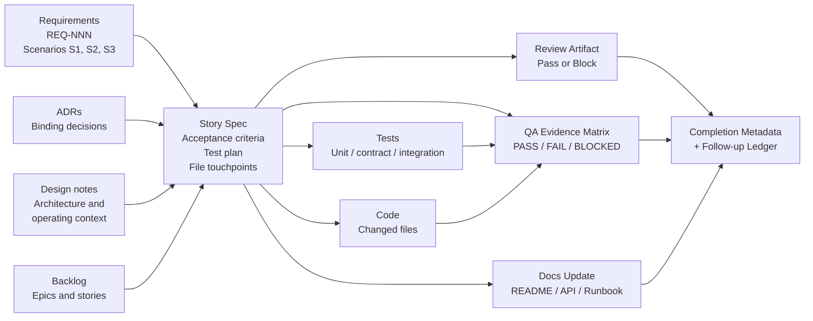

# Traceability

Traceability is the ability to answer, for any line of shipped code: *why does this exist, who decided it should look like this, and how do we know it works?*

This methodology achieves traceability by chaining artifacts. Each artifact has a defined predecessor and a defined successor. The story spec is the central hub where intent, decisions, and design meet implementation, review, QA, documentation, and completion metadata.

---

## The traceability model

Every arrow into the story spec is a piece of context the implementer is allowed to rely on. Every arrow out is evidence that the intent was delivered. Completion metadata closes the loop by recording the review summary, QA result, documentation diff, and any follow-up ledger entries in one place.

Each box in the diagram is a distinct artifact — defined by what it carries, not by where it is recorded. The current implementation bundles related artifacts into a small number of files for trace co-location: the story spec, story acceptance evidence, QA evidence matrix, completion metadata, and post-complete follow-up ledger entries all ride in the same `docs/features/{STORY-ID}-*.md` document because keeping the trace co-located makes it readable. They are still separate artifacts with separate owners. See [BUILDING-BLOCKS.md](BUILDING-BLOCKS.md) for the artifact set and the composition matrix.

---

## The story spec as traceability hub

The story spec is the central artifact for a reason: it is the only place where requirements, ADRs, design, acceptance criteria, tests, file touchpoints, and completion evidence all meet.

A well-formed story should make every one of these questions answerable without leaving the story document:

- **Which requirement or scenario caused this work?** Linked `REQ-NNN` and the specific scenario IDs (`S1`, `S2`...).
- **Which ADRs or design constraints bind the implementation?** Linked ADRs and named binding constraints.
- **Which acceptance criteria define completion?** The criteria list, each with a stable ID (`A1`, `A2`...).
- **Which tests or checks prove each criterion?** The test plan rows mapping criteria to test paths.
- **Which files changed?** The file touchpoints (planned) and the changed files (actual).
- **Which gates passed?** The review artifact reference and the QA matrix reference.
- **Which documentation surfaces were updated?** The documentation diff, or an explicit note that no surface needed to change.

If any of these is missing, the trace is incomplete. The story is not done.

---

## The six principles, anchored

The README's closing principles are not slogans. Each one names a specific artifact that enforces it.

| Principle | Enforced by |
|---|---|
| Requirements define intent | `REQ-NNN` refined requirements document, with Gherkin scenarios that become trace points downstream |
| ADRs preserve binding technical decisions | ADRs in `docs/decisions/`, linked from the story spec, that prevent silent substitution of persistence, transport, auth, or named dependencies |
| Design notes describe architecture and operating context | The design section of the project `README`, updated by `/design-application` |
| Epics and stories organize delivery | The backlog rows in the project `README`, maintained by `/plan-project` |
| Story specs turn intent into implementation-ready instructions | `docs/features/{STORY-ID}-*.md`, produced by `/plan-story` |
| Tests, review artifacts, QA evidence, and documentation close the loop | The test plan, story-review artifact, QA matrix, and documentation diff — all referenced from the story's completion metadata |

A principle without an artifact is a hope. Anchoring each one to a specific file is what turns the methodology from intent into discipline.

---

## How the trace stays intact

Three rules keep the trace from quietly breaking.

### Single source of truth per concern

Each concern has exactly one canonical file. Requirements live in `docs/requirements/`. Decisions live in ADRs. Design lives in the `README` design section. Story scope lives in the story document. Documentation lives in the surfaces it describes. If two files appear to disagree, work stops and a conflict is surfaced — the workflow does not pick the easier path.

### No silent substitution

An agent may not change a persistence location, transport, embedding stack, or named dependency versus what the story or its linked ADRs specify. If the spec is wrong or impossible, the agent stops and emits a conflict report citing the affected sections.

This rule exists because the most common failure mode in AI-assisted development is the model "improving" a binding decision without telling anyone.

### Story status discipline

The story document is the single source of truth for story progress. Status transitions and acceptance criteria checkboxes are updated *as work happens*, not batched at the end. The backlog status is derived from the story document, never the other way around.

This keeps the trace navigable from either direction: from a shipped feature back to the intent that caused it, or from a requirement forward to the evidence that satisfied it.

---

## Read next

- [PROCESS.md](PROCESS.md) — when in the lifecycle each artifact is produced.
- [BUILDING-BLOCKS.md](BUILDING-BLOCKS.md) — the composition matrix that names the agent, command, and template behind each artifact.
- [POST-STORY.md](POST-STORY.md) — how the trace is preserved for follow-ups, patches, and diffs without forcing every change through a full story.
