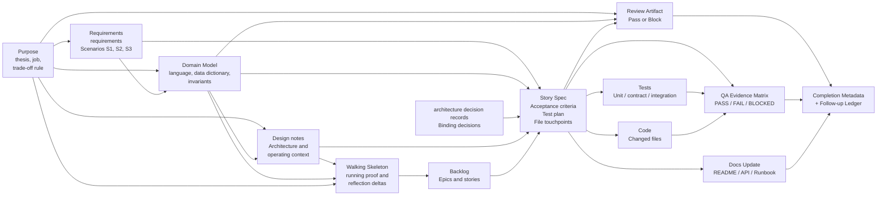
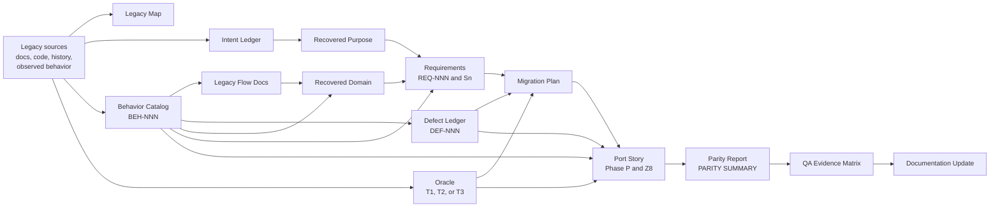

# Traceability

Traceability is the ability to answer, for any line of shipped code: *why does this exist, who decided it should look like this, and how do we know it works?*

This methodology achieves traceability by chaining artifacts. Each artifact has a defined predecessor and a defined successor. Purpose and domain model carry the conceptual center; the story spec is the central hub where intent, meaning, decisions, and design meet implementation, review, QA, documentation, and completion metadata.

---

## The traceability model

Every arrow into the story spec is a piece of context the implementer is allowed to rely on. Every arrow into the review artifact is a rubric the auditor uses to judge whether the changed surface remains faithful to the model. Every arrow out is evidence that the intent was delivered. Completion metadata closes the loop by recording the review summary, QA result, documentation diff, and any follow-up ledger entries in one place.

Each box in the diagram is a distinct artifact — defined by what it carries, not by where it is recorded. The current implementation bundles related artifacts into a small number of files for trace co-location: the story spec, story acceptance evidence, QA evidence matrix, completion metadata, and post-complete follow-up ledger entries all ride in the same `docs/features/{STORY-ID}-*.md` document because keeping the trace co-located makes it readable. They are still separate artifacts with separate owners. See [BUILDING-BLOCKS.md](BUILDING-BLOCKS.md) for the artifact set and the composition matrix.

Modernization adds provenance to the left side of the trace. A port story should be traceable not only back to purpose, domain, requirements, and ADRs, but also back to the legacy citation or oracle fixture that justified the recovered behavior.

This is why evidence grades matter. A citation marked `E1 verified` and a claim marked `E4 inferred` are not interchangeable, even if both appear in a polished artifact.

---

## The story spec as traceability hub

The story spec is the central handoff artifact for a reason: it is the only place where purpose, domain model, requirements, architecture decision records, design, acceptance criteria, tests, file touchpoints, and completion evidence all meet.

A well-formed story should make every one of these questions answerable without leaving the story document:

- **Which purpose does this serve?** Linked configured purpose artifact (`docs/PURPOSE.md` by default), including the thesis, trade-off rule, and anti-thesis relevant to the story.
- **Which domain model does this preserve?** Section 1a names the domain terms, entities, data dictionary fields, invariants, lifecycles, and consistency boundaries the story touches from the configured domain model (`docs/DOMAIN.md` by default).
- **Which requirement or scenario caused this work?** Linked requirements (`REQ-NNN-*.md`) and the specific scenario IDs (`S1`, `S2`...). Every Gherkin `Sn` ID the story implements must appear in the Test Plan's **Covers Sn** column of at least one row, or the story must state explicitly why a given `Sn` is out of scope.
- **Which architecture decision records or design constraints bind the implementation?** Linked architecture decision records and named binding constraints (Section 4), each mapped to a Phase Y `(binding)` criterion ID.
- **Which ports and adapters are in play?** Section 4b lists every port and adapter the story creates or modifies — port file, adapter implementation, and real backing service or fixture — or states explicitly that no integration boundaries are touched.
- **Which acceptance criteria define completion?** The criteria list, each with a stable ID (`A1`, `A2`..., `Y1`, `Z1`...) using markdown task syntax (`- [ ] **A1** — ...`) and exactly one `Evidence:` line per criterion.
- **Which tests or checks prove each criterion?** Section 8a Test Plan rows mapping criteria to test paths, with test level (`unit`, `contract`, `integration`, `e2e` / `ui`) and **Covers AC** / **Covers Sn** columns filled. Every port needs at least one `contract` row; every adapter needs at least one `integration` row against the real backing service (no mock of the boundary the adapter owns). Phase Y `(binding)` criteria cite the integration tests for adapters.
- **For port stories, which legacy behavior is being preserved or intentionally changed?** Section 1b links the `BEH-NNN` artifacts and evidence grades that justify the story scope.
- **For port stories, what oracle proves parity?** Section 8b links the oracle tier, fixture IDs, tolerances, and any acceptance data gaps. A `T3 documented-only` oracle must not be described as executable parity.
- **For port stories, which defect decisions apply?** The story links any `DEF-NNN` rows that say whether suspicious behavior is reproduced faithfully, fixed now, or fixed later.
- **Which files changed?** The file touchpoints (planned) and the changed files (actual).
- **Which gates passed?** The review artifact reference (including Phase Z6: zero `high` or `critical` `TEST-#`, `SEC-#`, `REL-#`, or `API-#` findings from `/review-story`, and Phase Z7: zero `high` or `critical` `MODEL-#` findings) and the QA matrix reference.
- **Which documentation surfaces were updated?** The documentation diff, or an explicit note that no surface needed to change.
- **What follow-up work happened after completion?** Post-complete Follow-up Ledger rows with `Change ref` (commit SHA, PR URL, or `uncommitted` / `TBD`) and `Review ref` (`none` or a path under `docs/reviews/` when `/review-diff` produced an artifact).

If any of these is missing, the trace is incomplete. The story is not done.

`/validate-story` checks this contract mechanically. Use `ready` before implementation, `complete` after shipping, and `followups` after `/patch-story` or `/reconcile-story` appends ledger rows.

---

## The principles, anchored

The README's closing principles are not slogans. Each one names a specific artifact that enforces it.

| Principle | Enforced by |
|---|---|
| Purpose defines the center | `docs/PURPOSE.md`, with the product thesis, job, north-star outcome, trade-off rule, anti-thesis, and success signals |
| Domain model defines meaning | `docs/DOMAIN.md`, with ubiquitous language, data dictionary fields, entities, relationships, invariants, lifecycles, and consistency boundaries |
| Requirements define behavior | refined requirements in `docs/requirements/REQ-NNN-*.md`, with Gherkin scenarios that become trace points downstream |
| architecture decision records preserve binding technical decisions | architecture decision records in `docs/decisions/`, linked from the story spec, that prevent silent substitution of persistence, transport, auth, or named dependencies |
| Design notes describe architecture and operating context | The design section of the project `README`, updated by `/design-application` |
| Walking skeletons expose tacit intent | `docs/features/SK-1-*.md` (or configured skeleton story), implemented and demoed before feature backlog planning; reflection deltas route back to `/refine-feature` or `/model-domain` |
| Epics and stories organize delivery | The backlog rows in the project `README`, maintained by `/plan-project` |
| Story specs turn intent into implementation-ready instructions | `docs/features/{STORY-ID}-*.md`, produced by `/plan-story`; validated by `/validate-story ready` |
| Tests, model-fidelity review, QA evidence, and documentation close the loop | The test plan (with **Covers AC** and **Covers Sn**), story-review artifact including `MODEL-#` counts, QA matrix, and documentation diff — all referenced from the story's completion metadata; post-complete follow-ups recorded in the ledger with **Change ref** and **Review ref** |
| Legacy behavior is evidence, not automatically requirement | `docs/modernization/behaviors/BEH-NNN-*.md`, legacy flow docs, intent ledger, and defect ledger, each with evidence grades and citations |
| Parity confidence cannot exceed the oracle tier | `docs/modernization/oracle.md`, port-story `Phase P`, `Z8`, and `docs/modernization/parity/{STORY-ID}-parity.md` |

A principle without an artifact is a hope. Anchoring each one to a specific file is what turns the methodology from intent into discipline.

---

## How the trace stays intact

Four rules keep the trace from quietly breaking.

### Single source of truth per concern

Each concern has exactly one canonical file. Purpose lives in `docs/PURPOSE.md`. Domain language and data meaning live in `docs/DOMAIN.md`. Requirements live in `docs/requirements/`. Decisions live in architecture decision records. Design lives in the `README` design section. Story scope lives in the story document. Documentation lives in the surfaces it describes. If two files appear to disagree, work stops and a conflict is surfaced — the workflow does not pick the easier path.

### No silent model drift

An agent may not introduce new runtime domain terms, fields, entity meanings, invariants, lifecycle states, or consistency boundaries without updating or explicitly deferring the configured domain model. The Auditor enforces this with `MODEL-#` findings during `/review-story`.

### No silent substitution

An agent may not change a persistence location, transport, embedding stack, or named dependency versus what the story or its linked architecture decision records specify. If the spec is wrong or impossible, the agent stops and emits a conflict report citing the affected sections.

This rule exists because the most common failure mode in AI-assisted development is the model "improving" a binding decision without telling anyone.

### No silent behavior improvement

In modernization work, an agent may not decide that legacy behavior should be cleaned up during the port. If behavior appears wrong, the defect ledger records the human decision: `reproduce-faithfully`, `fix-now`, or `fix-later`. The auditor and QA enforce this with `PAR-#` and `PROV-#` findings, `Phase P` parity criteria, and the `Z8` gate in port stories.

### Story status discipline

The story document is the single source of truth for story progress. Status transitions and acceptance criteria checkboxes are updated *as work happens*, not batched at the end. The backlog status is derived from the story document, never the other way around.

This keeps the trace navigable from either direction: from a shipped feature back to the intent that caused it, or from a requirement forward to the evidence that satisfied it.

### Post-complete follow-up trace

After a story is `Complete`, small verified changes do not reopen the story. They append rows to the Post-complete Follow-up Ledger with **Change ref** pointing at version control (commit SHA or PR URL) and **Review ref** pointing at a `/review-diff` artifact when one was produced. `/validate-story followups` confirms ledger rows are structurally consistent. `/reconcile-story` uses the same ledger when reconciling working-tree drift that was never recorded.

---

## Read next

- [PROCESS.md](PROCESS.md) — when in the lifecycle each artifact is produced.
- [MODERNIZATION.md](MODERNIZATION.md) — how legacy evidence, oracle tiers, defect decisions, and parity reports extend the trace.
- [BUILDING-BLOCKS.md](BUILDING-BLOCKS.md) — the composition matrix that names the agent, command, and template behind each artifact.
- [POST-STORY.md](POST-STORY.md) — how the trace is preserved for follow-ups, patches, and diffs without forcing every change through a full story.
