# Workflow Example

This walkthrough shows one concrete run of Artifact-Driven Development (ADD) using the sample application in [`example/`](example/): an LLM-maintained wiki for an existing Obsidian vault.

The goal is not to replay a chat transcript. The goal is to show how a vague product idea becomes durable artifacts that carry intent, decisions, implementation scope, review, QA, and completion evidence forward.

In ADD, prompts may start work, but artifacts are the source of truth.

---

## The Example Project

The sample application implements the LLM-wiki pattern:

- Raw Obsidian vault notes remain read-only.
- An LLM maintains a persistent wiki under a vault subdirectory, defaulting to `wiki/`.
- The wiki has durable files such as `SCHEMA.md`, `index.md`, `log.md`, generated pages, and `.ingested.json`.
- Stage 1 delivers usable Cursor commands first.
- Stage 2 implements the same behavior as a standalone Python CLI.

The intent-level artifacts that sit upstream of everything else live in [`example/docs/PURPOSE.md`](example/docs/PURPOSE.md) (the product thesis and trade-off rule) and [`example/docs/DOMAIN.md`](example/docs/DOMAIN.md) (the ubiquitous language, data dictionary, entities, and consistency boundaries). The raw source idea lives in [`example/docs/requirements/llm-wiki.md`](example/docs/requirements/llm-wiki.md). The refined requirements live in [`example/docs/requirements/REQ-001-llm-wiki-cli.md`](example/docs/requirements/REQ-001-llm-wiki-cli.md).

This walkthrough follows one small completed story:

[`S1-1: Ship wiki SCHEMA.md template`](example/docs/features/S1-1-wiki-schema-template.md)

That story is intentionally small. It is easier to understand the ADD trace on a small artifact before looking at a full application slice. Where the newer intent artifacts (purpose, domain model, walking skeleton) matter, the walkthrough calls out the upstream context that would now bind a story like `S1-1`.

---

## The Trace At A Glance

```mermaid
flowchart LR
    raw["Informal idea<br/>llm-wiki.md"]
    purpose["Purpose<br/>PURPOSE.md"]
    req["Refined requirements<br/>REQ-001"]
    domain["Domain model<br/>DOMAIN.md"]
    design["Design + ADRs<br/>README + docs/decisions"]
    skeleton["Walking skeleton<br/>SK-1"]
    story["Story spec<br/>S1-1"]
    implementation["Implementation<br/>template + verifier"]
    review["Review artifact<br/>S1-1-review"]
    qa["QA evidence<br/>completion metadata"]
    stageGate["Stage 1 gate<br/>S1-6"]

    raw --> purpose --> req --> domain --> design --> skeleton --> story
    story --> implementation --> review --> qa --> stageGate
```



Each arrow is a handoff between artifacts. The next step does not depend on somebody remembering what the model said. It depends on a file that can be reviewed, linked, audited, and reused. Purpose and the domain model sit at the front because they carry the product's center of gravity and its language; the walking skeleton proves the design runs before feature stories build on it.

---

## 1. Informal Idea

The source material describes a pattern, not an implementation. It says the LLM should maintain a persistent, compounding wiki from raw documents:

> Instead of just retrieving from raw documents at query time, the LLM incrementally builds and maintains a persistent wiki.

That is useful intent, but it is not yet implementation-ready. It does not fully answer questions like:

- What exactly is in scope for the first deliverable?
- What must never be modified?
- What files define the wiki contract?
- Which behaviors need executable evidence?
- What future architecture must this first slice avoid foreclosing?

ADD does not ask the implementer to infer those answers from the chat. The first step is to state the product's purpose, then refine the idea into requirements.

---

## 2. Product Purpose

Before requirements, [`example/docs/PURPOSE.md`](example/docs/PURPOSE.md) captures the product's center of gravity so every later trade-off has a tiebreaker. It is deliberately short — a decision lens, not another attribute list.

The purpose that binds this example is:

> **Thesis.** ADD LLM Wiki is a local-first tool that lets a knowledge worker turn an existing Obsidian vault into a persistent, compounding LLM-maintained wiki without surrendering ownership of the raw notes.
>
> **Trade-off rule.** When goals conflict, optimize for **durable, inspectable knowledge artifacts under user control** over **maximum automation or query-time convenience**.

The purpose artifact also names an **anti-thesis** — the tempting-but-wrong shapes to reject, such as a transient chat/RAG wrapper that never improves the persistent wiki, or a tool that rewrites the user's raw notes. That anti-thesis is what later model-fidelity review checks a change against.

The Modeler agent owns this artifact via [`/define-purpose`](assets/commands/define-purpose.md). The human approves it at the purpose gate before requirements work begins.

---

## 3. Refined Requirements

[`REQ-001`](example/docs/requirements/REQ-001-llm-wiki-cli.md) turns the informal idea into a durable requirement artifact. It captures goals, non-goals, delivery phases, and Gherkin scenarios.

For this walkthrough, the important scenarios are:

- `S4` — `SCHEMA.md` describes layers, workflows, excludes, and index/log conventions.
- `S13` — log entries use a grep-friendly heading format.
- `S5` — raw sources remain immutable.
- `S18` — Stage 1 is a fully usable Cursor-based daily driver, not a prototype.

Those scenario IDs matter because they become trace points. Later story test plans use the **Covers Sn** column to show which requirement scenarios a test or verifier proves.

The requirement artifact is already doing more than a prompt can do reliably: it gives later agents stable IDs, clear scope, and non-goals.

---

## 4. Domain Model And Data Dictionary

With purpose and requirements in hand, [`example/docs/DOMAIN.md`](example/docs/DOMAIN.md) makes the application's *meaning* explicit so code and reviews can be judged against it rather than against a developer's private mental model. Human teams often skip this because "everyone knows what a wiki is"; an AI agent has no such shared local context.

For the `S1-1` slice, the relevant domain content is:

- **Ubiquitous language.** `Vault`, `Raw source`, `Wiki`, `Schema`, `Index`, `Log` each get one definition and a list of synonyms to avoid — so the schema template and later code use the same words.
- **Data dictionary.** Fields such as `Wiki.directory`, `Schema.exclude_paths`, and `Log.entry_heading` get a type/format, requiredness, constraints, and a source citation. `Log.entry_heading` is exactly the grep-parseable `## [YYYY-MM-DD] {operation} | {title}` format that `S1-1` must ship.
- **Consistency boundaries.** The `Vault boundary` (raw-source immutability) and `Wiki boundary` (required layout, standard links, append-only log) are named as boundaries the design must preserve — and they line up with the ports in the hexagonal design.

The Modeler owns this artifact via [`/model-domain`](assets/commands/model-domain.md). It is a living artifact: later stories that introduce new nouns, fields, invariants, or boundaries must update it rather than drift, and the human approves it at the domain-model gate.

---

## 5. Design And Decisions

The design is recorded in [`example/README.md`](example/README.md). Binding decisions are recorded in ADRs under [`example/docs/decisions/`](example/docs/decisions/).

For `S1-1`, three ADRs matter:

- [`ADR-003: Vault/wiki layout`](example/docs/decisions/ADR-003-vault-wiki-layout.md) defines the `SCHEMA.md` minimum sections, default excludes, log format, and path conventions.
- [`ADR-002: Port interfaces`](example/docs/decisions/ADR-002-port-interfaces.md) says the future `SchemaPort` will parse the schema, so the markdown shape cannot drift freely.
- [`ADR-001: Hexagonal architecture`](example/docs/decisions/ADR-001-hexagonal-architecture.md) makes Stage 1 a behavioral contract that Stage 2 must not contradict.

This is where ADD prevents a common AI failure mode: the model silently substituting an implementation choice. If a persistence location, parser boundary, package, architecture style, or file layout is binding, it belongs in an artifact the story must link to.

---

## 6. The Walking Skeleton

Some intent is tacit. A user often recognizes "that is not what I meant" only when they see a running thing. So before feature stories, the Architect plans a walking skeleton via [`/plan-skeleton`](assets/commands/plan-skeleton.md): the thinnest end-to-end slice that proves the approved purpose, domain model, architecture, and boundaries can actually execute together.

In this example that story is [`SK-1: Walking Skeleton`](example/docs/features/SK-1-walking-skeleton.md). It is planned rather than completed, so it shows the *shape* of the loop rather than completion evidence. What makes it a skeleton and not a feature:

- Its acceptance criteria are **structural**, not behavioral: boot through the real composition root, execute one operation across every planned boundary, and produce a demo a human can run.
- Its binding constraints (`Y1`–`Y3`) forbid faking the wiring — it must use the real composition root, cross real (or hermetic-trivial) adapters, and preserve domain language and boundaries.
- It includes a **reflection checkpoint**: after the demo, human feedback is routed explicitly — a requirement delta goes back to [`/refine-feature`](assets/commands/refine-feature.md), a meaning/language delta goes back to [`/model-domain`](assets/commands/model-domain.md), and "no delta" is recorded rather than assumed.

The skeleton is where purpose and the domain model earn their keep: they give the human a concrete thing to react to early, and any "not what I meant" becomes a durable artifact update instead of a lost chat comment.

---

## 7. How The Story Artifact Was Produced

The output artifact is the main thing to read, but ADD is repeatable because three reusable definitions shape that output:

- Agent: [`assets/agents/architect.md`](assets/agents/architect.md)
- Command: [`assets/commands/plan-story.md`](assets/commands/plan-story.md)
- Template: [`assets/templates/user-story-template.md`](assets/templates/user-story-template.md)

Read them as separate dimensions of control:

| Definition | What it controls | What it contributes |
|---|---|---|
| Agent | Concern | The Architect owns requirements, design, ADRs, backlog, and story specs. |
| Command | Workflow step | `/plan-story` tells the Architect what inputs to read, what conflicts to stop on, and what traceability rules must hold. |
| Template | Output shape | The user-story template requires linked ADRs, Definition of Ready, binding constraints, file touchpoints, acceptance criteria, a test plan, completion metadata, and a follow-up ledger. |

The important point is that the story is not just "what the model decided to write." It is the result of a controlled composition:

```text
Architect agent + /plan-story command + user-story template = story artifact
```

The definitions are useful in the walkthrough as short references, not as the main narrative. The produced artifact remains the source of truth.

---

## 8. The Story Spec

[`S1-1`](example/docs/features/S1-1-wiki-schema-template.md) turns the requirement and ADR context into an implementation-ready contract:

> Add the repo-shipped `templates/wiki/SCHEMA.md` that defines vault layers, ingest/query/lint workflows, default exclude paths, link conventions, and log entry format so Stage 1 commands and Stage 2 `SchemaPort` share one contract.

The story makes several things explicit that would otherwise be buried in a prompt or a developer's head.

### Scope

The story says exactly what it does and does not do:

- It creates the canonical schema template.
- It creates a verifier script.
- It does not create Cursor commands.
- It does not initialize a user vault.
- It does not implement the Python parser.
- It does not modify user vault files.

That gives the implementer permission to move quickly without expanding the story.

### Binding Constraints

The story restates ADR-backed rules locally:

- The template path is exactly `templates/wiki/SCHEMA.md`.
- Required sections include **Layers**, **Workflows**, **Excludes**, **Conventions**, and **Index and log**.
- Default excludes include `.obsidian/`, `wiki/`, and dotfiles.
- Wiki pages use standard markdown links, not Obsidian `[[wikilinks]]`.
- Log headings use `## [YYYY-MM-DD] {operation} | {title}`.

These are not suggestions. They are constraints the implementer and QA can verify.

### Acceptance Criteria And Evidence

The acceptance criteria are checkboxed and evidence-backed. For example:

```markdown
- [x] **B3** — **Excludes** section lists `.obsidian/`, `wiki/`, and `.*` as default excludes
  - Additional user excludes may be documented as editable bullets below defaults
  - Evidence: `scripts/verify-wiki-schema-template.sh::B3_excludes_s4`
```

This is the core of ADD: the story does not merely say what should be true. It names the check that proves it.

### Scenario Traceability

The story's test plan maps acceptance criteria back to requirement scenarios:

| Evidence | Covers AC | Covers Sn |
|---|---|---|
| `scripts/verify-wiki-schema-template.sh::B1_layers_s4` | `B1`, `Y1` | `S4` |
| `scripts/verify-wiki-schema-template.sh::C1_log_format_s13` | `C1`, `Y1` | `S13` |
| `scripts/verify-wiki-schema-template.sh::D1_markdown_links` | `D1` | `S4` |

That mapping lets a reader start from a requirement scenario and find the story evidence that satisfied it.

### Domain Model Touchpoints

Under the current template, a story also declares its **Section 1a domain model touchpoints**: the ubiquitous-language terms, data-dictionary fields, and boundaries it uses or affects. For `S1-1` that is the `Schema`, `Log`, and `Excludes` vocabulary plus the `Log.entry_heading` field and the `Wiki boundary`. Declaring them keeps the story honest about which parts of [`DOMAIN.md`](example/docs/DOMAIN.md) it must respect, and gives review a concrete list to check fidelity against.

---

## 9. Implementation, Review, And QA

When implementation completed, the story did not just rely on code changes. It accumulated evidence in the artifact.

The completion metadata records:

- Completion date.
- Completion ref.
- Final review summary.
- Final QA command.
- QA result.
- Documentation handoff.

The review artifact, [`S1-1-review.md`](example/docs/features/S1-1-review.md), starts with a machine-readable summary:

```text
REVIEW SUMMARY: result=Pass TEST-critical=0 TEST-high=0 SEC-critical=0 SEC-high=0 REL-critical=0 REL-high=0 API-critical=0 API-high=0
```

This example review predates the model-fidelity gate. Reviews produced under the current [story-review template](assets/templates/story-review-template.md) add a **Model Fidelity** category, so their summary line also carries `MODEL-critical=<N> MODEL-high=<N>`. That category asks a different question than the others: not "is the code correct or safe," but "is the code true to the approved purpose and domain model." A change that ships working code while quietly betraying the anti-thesis or renaming a domain term fails model fidelity even when every other category passes. The gate is enforced through the story's Phase Z `Z7` criterion.

The story completion metadata points back to that summary and to the verifier command:

```text
Final QA command: bash scripts/verify-wiki-schema-template.sh
QA result: All criteria PASS (15/15); verifier exit 0
```

Now "done" has a concrete meaning. A reader can inspect the story, the review, and the verifier evidence without reading the model transcript.

---

## 10. The Stage-Level Gate

`S1-1` proves one small artifact. [`S1-6`](example/docs/features/S1-6-stage1-e2e-acceptance.md) proves the Stage 1 workflow works end to end.

`S1-6` runs the complete Cursor-based path on a fixture vault:

1. `/init-wiki`
2. `/wiki-ingest`
3. `/wiki-query`
4. `/wiki-lint`
5. `bash scripts/verify-stage1-e2e.sh`

Its binding checks confirm:

- `SCHEMA.md`, `index.md`, and `log.md` exist.
- At least one generated wiki page exists.
- `.ingested.json` records at least one source.
- `log.md` contains `init`, `ingest`, `query`, and `lint` entries.
- Raw source notes under `test/vault/daily/` are unchanged.
- Stage 2 CLI was not used to pass the Stage 1 gate.

This is why ADD scales beyond a single story. The small story has criterion-level proof; the stage gate has workflow-level proof.

---

## What To Notice

The power of the workflow is not that the model wrote markdown. The power is that the markdown carries the work.

- The purpose artifact says what the product fundamentally is and how to break ties.
- The requirement artifact says what the product must do.
- The domain model says what the product's words, data, and boundaries mean.
- The README and ADRs say which decisions bind implementation.
- The walking skeleton proves the design runs and surfaces tacit intent early.
- The story says what this slice must accomplish and what is out of scope.
- The test plan says how each criterion will be proven.
- The review artifact says whether the changed surface has blocking risk, including whether it stays true to purpose and domain (model fidelity).
- The QA evidence says whether each criterion passed.
- The completion metadata says what "Complete" meant at the time.
- The follow-up ledger keeps later changes from disappearing into drift.

That is the main promise of Artifact-Driven Development: logic, decisions, evidence, and delivery state are on the surface. A new developer, reviewer, support engineer, auditor, or project lead should not need to reconstruct the story from chat history or reverse-engineer intent from code.

---

## How To Read The Example

If you want the shortest path through the sample application, read these files in order:

1. [`example/docs/requirements/llm-wiki.md`](example/docs/requirements/llm-wiki.md) — the informal source idea.
2. [`example/docs/PURPOSE.md`](example/docs/PURPOSE.md) — the product thesis, trade-off rule, and anti-thesis.
3. [`example/docs/requirements/REQ-001-llm-wiki-cli.md`](example/docs/requirements/REQ-001-llm-wiki-cli.md) — refined requirements and scenarios.
4. [`example/docs/DOMAIN.md`](example/docs/DOMAIN.md) — ubiquitous language, data dictionary, entities, and boundaries.
5. [`example/README.md`](example/README.md) — design, stack, decisions summary, and backlog.
6. [`example/docs/decisions/ADR-003-vault-wiki-layout.md`](example/docs/decisions/ADR-003-vault-wiki-layout.md) — the binding layout decision for this story.
7. [`example/docs/features/SK-1-walking-skeleton.md`](example/docs/features/SK-1-walking-skeleton.md) — the walking-skeleton story and reflection loop.
8. [`example/docs/features/S1-1-wiki-schema-template.md`](example/docs/features/S1-1-wiki-schema-template.md) — the story spec and completion evidence.
9. [`example/docs/features/S1-1-review.md`](example/docs/features/S1-1-review.md) — the review gate.
10. [`example/docs/features/S1-6-stage1-e2e-acceptance.md`](example/docs/features/S1-6-stage1-e2e-acceptance.md) — the Stage 1 end-to-end gate.

Then read the reusable machinery:

1. [`assets/agents/modeler.md`](assets/agents/modeler.md) and [`assets/agents/architect.md`](assets/agents/architect.md)
2. [`assets/commands/define-purpose.md`](assets/commands/define-purpose.md), [`assets/commands/model-domain.md`](assets/commands/model-domain.md), [`assets/commands/plan-skeleton.md`](assets/commands/plan-skeleton.md), and [`assets/commands/plan-story.md`](assets/commands/plan-story.md)
3. [`assets/templates/purpose-template.md`](assets/templates/purpose-template.md), [`assets/templates/domain-model-template.md`](assets/templates/domain-model-template.md), [`assets/templates/walking-skeleton-template.md`](assets/templates/walking-skeleton-template.md), and [`assets/templates/user-story-template.md`](assets/templates/user-story-template.md)

The first list shows what ADD produced for one product. The second list shows why the production process is repeatable.

---

## Read Next

- [`PROCESS.md`](PROCESS.md) — the full lifecycle and human gates.
- [`BUILDING-BLOCKS.md`](BUILDING-BLOCKS.md) — agents, commands, templates, artifacts, evidence, and gates.
- [`TRACEABILITY.md`](TRACEABILITY.md) — how intent flows through artifacts to evidence.
- [`WHY-IT-WORKS.md`](WHY-IT-WORKS.md) — why the methodology addresses common AI-assisted development failures.

