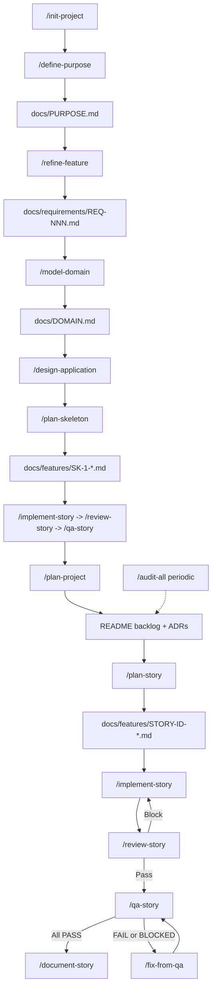

# AI-assisted development workflow

This document describes the end-to-end flow for building software with Cursor using the agents, commands, and templates in this directory (`~/.cursor`). It lives **outside** the Cursor application bundle, so it persists across Cursor app updates. The canonical copy to track in git is here; keep it in version control with the rest of your `~/.cursor` config.

**House rules** shared by all agents: [AGENTS.md](AGENTS.md).

---

## High-level flow

- **`/init-project`** is optional: scaffolds `README` + `docs/features` from [templates/readme-template.md](templates/readme-template.md). You can skip straight to `/design-application` with requirements for legacy projects.
- **`/define-purpose`** captures the product thesis, job, north-star outcome, trade-off rule, anti-thesis, and success signals via [templates/purpose-template.md](templates/purpose-template.md).
- **`/refine-feature`** turns raw notes into clarified requirements with Gherkin scenarios (`S1`, `S2`, …) via [templates/requirements-template.md](templates/requirements-template.md).
- **`/model-domain`** creates the ubiquitous language, data dictionary, entities, relationships, invariants, lifecycles, and consistency boundaries via [templates/domain-model-template.md](templates/domain-model-template.md).
- **`/design-application`** fills the project `README` with architecture; **`/plan-project`** adds epics/stories to the backlog only.
- **`/plan-skeleton`** produces a walking-skeleton story via [templates/walking-skeleton-template.md](templates/walking-skeleton-template.md), then the normal implement/review/QA tail proves one running path before feature planning.
- **`/plan-story`** produces a full story doc using [templates/user-story-template.md](templates/user-story-template.md) (ports/adapters, test plan, binding criteria).
- **`/assess-modernization`** starts the brownfield lane: legacy mapping, history mining, dependency inventory, translation gaps, and oracle probing.
- **`/document-legacy`** recovers evidence-graded behavior, flows, purpose/domain language, and defect decisions before requirements harden.
- **`/plan-port-story`** produces a port story using [templates/port-story-template.md](templates/port-story-template.md), including `Phase P`, `8b. Parity Plan`, and `Z8`.
- **`/complete-port-story`** runs the normal story tail with `/verify-parity` inserted between review and QA.
- **`/implement-story`** drives red-first implementation per [agents/implementer.md](agents/implementer.md).
- **`/review-story`** is a soft gate (changed-surface audit) before QA; output gates Phase Z criterion **Z6**.
- **`/qa-story`** validates acceptance criteria with evidence; failures loop through **`/fix-from-qa`**.
- **`/document-story`** syncs docs/README when the story is done.
- **`/audit-all`** is for periodic or scoped full-repo health ([templates/audit-template.md](templates/audit-template.md)); use **`/review-diff`** for PR-style review without a story file.

---

## Commands (quick reference)

| Command | Purpose |
|---------|---------|
| [init-project](commands/init-project.md) | Human: scaffold README + `docs/features` |
| [define-purpose](commands/define-purpose.md) | Modeler: `docs/PURPOSE.md` product thesis + trade-off rule |
| [refine-feature](commands/refine-feature.md) | Architect: refined REQ file + Gherkin `Sn` scenarios |
| [model-domain](commands/model-domain.md) | Modeler: `docs/DOMAIN.md` ubiquitous language + data dictionary |
| [design-application](commands/design-application.md) | Architect: full README design from requirements |
| [plan-skeleton](commands/plan-skeleton.md) | Architect: walking-skeleton story before backlog planning |
| [plan-project](commands/plan-project.md) | Architect: backlog epics/stories only |
| [plan-story](commands/plan-story.md) | Architect: `docs/features/{STORY-ID}-*.md` |
| [implement-story](commands/implement-story.md) | Implementer: code + story checkboxes |
| [review-story](commands/review-story.md) | Auditor: `docs/features/{STORY-ID}-review.md`, Z6 gate |
| [review-diff](commands/review-diff.md) | Auditor: review arbitrary git range |
| [qa-story](commands/qa-story.md) | QA: criterion evidence matrix |
| [fix-from-qa](commands/fix-from-qa.md) | Implementer: repair FAIL/BLOCKED only |
| [document-story](commands/document-story.md) | Docs-PM: README/OpenAPI/etc. |
| [map-repo](commands/map-repo.md) | Auditor: system map into `audit-findings.md` |
| [audit-all](commands/audit-all.md) | Full audit pipeline + triage |
| [triage-audit-findings](commands/triage-audit-findings.md) | Reconcile fix-now vs defer |
| [map-legacy](commands/map-legacy.md) | Archaeologist: legacy map |
| [mine-history](commands/mine-history.md) | Archaeologist: intent ledger |
| [inventory-dependencies](commands/inventory-dependencies.md) | Migration Strategist: dependency ledger |
| [analyze-translation-gap](commands/analyze-translation-gap.md) | Migration Strategist: source-to-target gap register |
| [build-oracle](commands/build-oracle.md) | Implementer: oracle probe or fixture/harness build |
| [assess-modernization](commands/assess-modernization.md) | Migration Strategist: feasibility verdict and risk register |
| [catalog-behavior](commands/catalog-behavior.md) | Archaeologist: `BEH-NNN` behavior artifacts |
| [trace-flow](commands/trace-flow.md) | Archaeologist: legacy flow trace |
| [recover-domain](commands/recover-domain.md) | Modeler: recovered purpose and domain model |
| [ledger-defects](commands/ledger-defects.md) | Archaeologist: defect decisions ledger |
| [document-legacy](commands/document-legacy.md) | Orchestrator: behavior, flow, domain, and defect recovery |
| [plan-migration](commands/plan-migration.md) | Migration Strategist: staging, slice, cutover, and parity plan |
| [plan-port-story](commands/plan-port-story.md) | Architect: modernization port story |
| [verify-parity](commands/verify-parity.md) | QA: parity report for a port story |
| [complete-port-story](commands/complete-port-story.md) | Orchestrator: implement/review/parity/QA/document/validate |

Category audits: [audit-tooling](commands/audit-tooling.md), [audit-reliability](commands/audit-reliability.md), [audit-db](commands/audit-db.md), [audit-api-contracts](commands/audit-api-contracts.md), [audit-security](commands/audit-security.md), [audit-performance](commands/audit-performance.md), [audit-test-coverage](commands/audit-test-coverage.md).

---

## Agents

| Agent | File |
|-------|------|
| Modeler | [agents/modeler.md](agents/modeler.md) |
| Architect | [agents/architect.md](agents/architect.md) |
| Implementer | [agents/implementer.md](agents/implementer.md) |
| QA | [agents/qa.md](agents/qa.md) |
| Docs + PM | [agents/docs-pm.md](agents/docs-pm.md) |
| Auditor | [agents/auditor.md](agents/auditor.md) |
| Archaeologist | [agents/archaeologist.md](agents/archaeologist.md) |
| Migration Strategist | [agents/migration-strategist.md](agents/migration-strategist.md) |

---

## Templates

| Template | Path |
|----------|------|
| README / design hub | [templates/readme-template.md](templates/readme-template.md) |
| Purpose | [templates/purpose-template.md](templates/purpose-template.md) |
| Domain model / data dictionary | [templates/domain-model-template.md](templates/domain-model-template.md) |
| Walking skeleton | [templates/walking-skeleton-template.md](templates/walking-skeleton-template.md) |
| ADR | [templates/adr-template.md](templates/adr-template.md) |
| Refined requirements | [templates/requirements-template.md](templates/requirements-template.md) |
| User story | [templates/user-story-template.md](templates/user-story-template.md) |
| Port story | [templates/port-story-template.md](templates/port-story-template.md) |
| Full-repo audit report | [templates/audit-template.md](templates/audit-template.md) |
| Per-story review | [templates/story-review-template.md](templates/story-review-template.md) |
| Modernization assessment | [templates/modernization-assessment-template.md](templates/modernization-assessment-template.md) |
| Legacy map | [templates/legacy-map-template.md](templates/legacy-map-template.md) |
| Intent ledger | [templates/intent-ledger-template.md](templates/intent-ledger-template.md) |
| Dependency ledger | [templates/dependency-ledger-template.md](templates/dependency-ledger-template.md) |
| Translation gap analysis | [templates/translation-gap-template.md](templates/translation-gap-template.md) |
| Oracle strategy | [templates/oracle-template.md](templates/oracle-template.md) |
| Behavior catalog | [templates/behavior-catalog-template.md](templates/behavior-catalog-template.md) |
| Legacy flow | [templates/legacy-flow-template.md](templates/legacy-flow-template.md) |
| Defect ledger | [templates/defect-ledger-template.md](templates/defect-ledger-template.md) |
| Migration plan | [templates/migration-plan-template.md](templates/migration-plan-template.md) |
| Parity report | [templates/parity-report-template.md](templates/parity-report-template.md) |

---

## Typical session order (new feature)

1. `/define-purpose @your-notes` → commit `docs/PURPOSE.md` in the **target project** repo.
2. `/refine-feature @your-notes` → commit `docs/requirements/REQ-001-*.md`.
3. `/model-domain @docs/requirements/REQ-001-*.md` → commit `docs/DOMAIN.md`.
4. `/design-application @docs/requirements/REQ-001-*.md` (or folder).
5. `/plan-skeleton SK-1` → walking-skeleton story.
6. Run the skeleton through `/implement-story`, `/review-story`, `/qa-story`, and `/document-story`, then demo it and route reflection deltas to `/refine-feature` or `/model-domain`.
7. `/plan-project @docs/requirements/...` → backlog rows in target `README`.
8. For each story ID: `/plan-story FND-1` → story doc + backlog link.
9. `/implement-story FND-1`
10. `/review-story FND-1` → fix blockers until gate **Pass**.
11. `/qa-story FND-1` → if needed `/fix-from-qa FND-1` then re-`/qa-story`.
12. `/document-story FND-1`

## Typical session order (modernization)

1. `/assess-modernization /path/to/legacy target: <target stack>` → `docs/modernization/ASSESSMENT.md` and assessment-phase ledgers.
2. Human accepts the verdict (`go`, `go-with-conditions`, or `no-go`) and resolves any conditions needed to proceed.
3. `/document-legacy @docs/modernization/ASSESSMENT.md` → behavior catalog, flow docs, recovered purpose/domain, defect ledger.
4. Human accepts recovered documentation and records defect decisions.
5. `/refine-feature @docs/modernization/behaviors/BEH-NNN-short-slug.md` → requirements with `Sn` scenario trace points.
6. `/plan-migration @docs/modernization/ASSESSMENT.md @docs/requirements/` → migration plan and ADR triggers.
7. `/design-application @docs/requirements/REQ-NNN-short-slug.md` and `/plan-project @docs/modernization/migration-plan.md`.
8. `/plan-port-story STORY-ID BEH-NNN` → port story with `Phase P`, `8b. Parity Plan`, and `Z8`.
9. `/complete-port-story STORY-ID` → implement, review, verify parity, QA, document, validate.

Project files live in the **application repo**; this file documents commands that live under **`~/.cursor`**.
