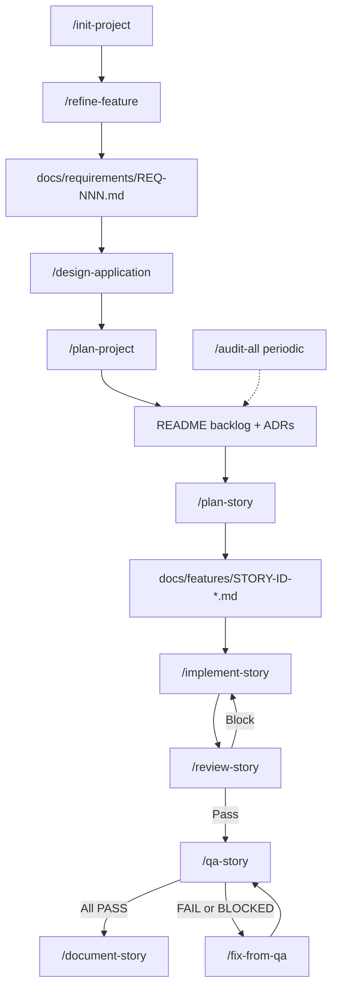

# AI-assisted development workflow

This document describes the end-to-end flow for building software with Cursor using the agents, commands, and templates in this directory (`~/.cursor`). It lives **outside** the Cursor application bundle, so it persists across Cursor app updates. The canonical copy to track in git is here; keep it in version control with the rest of your `~/.cursor` config.

**House rules** shared by all agents: [AGENTS.md](AGENTS.md).

---

## High-level flow

- **`/init-project`** is optional: scaffolds `README` + `docs/features` from [templates/readme-template.md](templates/readme-template.md). You can skip straight to `/design-application` with requirements.
- **`/refine-feature`** turns raw notes into clarified requirements with Gherkin scenarios (`S1`, `S2`, …) via [templates/requirements-template.md](templates/requirements-template.md).
- **`/design-application`** fills the project `README` with architecture; **`/plan-project`** adds epics/stories to the backlog only.
- **`/plan-story`** produces a full story doc using [templates/user-story-template.md](templates/user-story-template.md) (ports/adapters, test plan, binding criteria).
- **`/implement-story`** drives red-first implementation per [agents/implementer.md](agents/implementer.md).
- **`/review-story`** is a soft gate (changed-surface audit) before QA; output gates Phase Z criterion **Z6**.
- **`/qa-story`** validates acceptance criteria with evidence; failures loop through **`/fix-from-qa`**.
- **`/document-story`** syncs docs/README when the story is done.
- **`/audit-all`** is for periodic or scoped full-repo health ([templates/audit-template.md](templates/audit-template.md)); use **`/review-diff`** for PR-style review without a story file.

---

## Commands (quick reference)

| Command | Purpose |
|---------|---------|
| [init-project](commands/init-project.md) | Human: scaffold README + `docs/features` |
| [refine-feature](commands/refine-feature.md) | Architect: refined REQ file + Gherkin `Sn` scenarios |
| [design-application](commands/design-application.md) | Architect: full README design from requirements |
| [plan-project](commands/plan-project.md) | Architect: backlog epics/stories only |
| [plan-story](commands/plan-story.md) | Architect: `docs/features/{STORY-ID}-*.md` |
| [implement-story](commands/implement-story.md) | Implementer: code + story checkboxes |
| [review-story](commands/review-story.md) | Auditor: `docs/features/{STORY-ID}-review.md`, Z6 gate |
| [review-diff](commands/review-diff.md) | Auditor: review arbitrary git range |
| [qa-story](commands/qa-story.md) | QA: criterion evidence matrix |
| [fix-from-qa](commands/fix-from-qa.md) | Implementer: repair FAIL/BLOCKED only |
| [document-story](commands/document-story.md) | Docs-PM: README/OpenAPI/etc. |
| [map-repo](commands/map-repo.md) | Auditor: system map into `audit-findings.md` |
| [audit-all](commands/audit-all.md) | Full audit pipeline + triage |
| [triage-audit-findings](commands/triage-audit-findings.md) | Reconcile fix-now vs defer |

Category audits: [audit-tooling](commands/audit-tooling.md), [audit-reliability](commands/audit-reliability.md), [audit-db](commands/audit-db.md), [audit-api-contracts](commands/audit-api-contracts.md), [audit-security](commands/audit-security.md), [audit-performance](commands/audit-performance.md), [audit-test-coverage](commands/audit-test-coverage.md).

---

## Agents

| Agent | File |
|-------|------|
| Architect | [agents/architect.md](agents/architect.md) |
| Implementer | [agents/implementer.md](agents/implementer.md) |
| QA | [agents/qa.md](agents/qa.md) |
| Docs + PM | [agents/docs-pm.md](agents/docs-pm.md) |
| Auditor | [agents/auditor.md](agents/auditor.md) |

---

## Templates

| Template | Path |
|----------|------|
| README / design hub | [templates/readme-template.md](templates/readme-template.md) |
| ADR | [templates/adr-template.md](templates/adr-template.md) |
| Refined requirements | [templates/requirements-template.md](templates/requirements-template.md) |
| User story | [templates/user-story-template.md](templates/user-story-template.md) |
| Full-repo audit report | [templates/audit-template.md](templates/audit-template.md) |
| Per-story review | [templates/story-review-template.md](templates/story-review-template.md) |

---

## Typical session order (new feature)

1. `/refine-feature @your-notes` → commit `docs/requirements/REQ-001-*.md` in the **target project** repo.
2. `/design-application @docs/requirements/REQ-001-*.md` (or folder).
3. `/plan-project @docs/requirements/...` → backlog rows in target `README`.
4. For each story ID: `/plan-story FND-1` → story doc + backlog link.
5. `/implement-story FND-1`
6. `/review-story FND-1` → fix blockers until gate **Pass**.
7. `/qa-story FND-1` → if needed `/fix-from-qa FND-1` then re-`/qa-story`.
8. `/document-story FND-1`

Project files live in the **application repo**; this file documents commands that live under **`~/.cursor`**.
