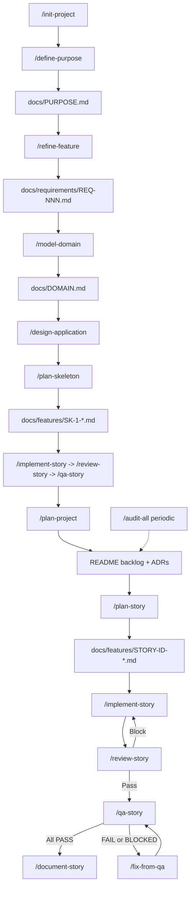

# AI-assisted development workflow

This document describes the end-to-end flow for building software with Cursor using the agents, commands, and templates in this directory (`~/.cursor`). It lives **outside** the Cursor application bundle, so it persists across Cursor app updates. The canonical copy to track in git is here; keep it in version control with the rest of your `~/.cursor` config.

**House rules** shared by all agents: [AGENTS.md](AGENTS.md).

---

## High-level flow

- **`/init-project`** is optional: scaffolds `README` + `docs/features` from [templates/readme-template.md](templates/readme-template.md). Omit `## Modernization` on greenfield. For a brownfield port, prefer `/assess-modernization` to create the README hub. You can skip straight to `/design-application` with requirements for existing greenfield projects.
- **`/define-purpose`** captures the product thesis, job, north-star outcome, trade-off rule, anti-thesis, and success signals via [templates/purpose-template.md](templates/purpose-template.md).
- **`/refine-feature`** turns raw notes or recovered path details into clarified requirements with Gherkin scenarios (`S1`, `S2`, …) via [templates/requirements-template.md](templates/requirements-template.md). Path details become section 4b provenance on the REQ.
- **`/model-domain`** creates the ubiquitous language, data dictionary, entities, relationships, invariants, lifecycles, and consistency boundaries via [templates/domain-model-template.md](templates/domain-model-template.md).
- **`/design-application`** fills the project `README` with architecture; **`/plan-project`** adds epics/stories to the backlog only. On a port, `/plan-project` consumes the migration plan as sequencing.
- **`/plan-skeleton`** produces a walking-skeleton story via [templates/walking-skeleton-template.md](templates/walking-skeleton-template.md), then the normal implement/review/QA tail proves one running path before feature planning.
- **`/plan-story`** produces a full story doc using [templates/user-story-template.md](templates/user-story-template.md) (ports/adapters, test plan, binding criteria). When the linked REQ has section 4b, the same template copies provenance, slice prerequisites, and `parity` test rows.
- **`/assess-modernization`** starts the brownfield lane: path inventory, dependency inventory, dependency graph, impedance analysis, and oracle probing. The assessment is the five-minute picture; inventories are reference. This command also creates `README.md` from the README template if it is missing, including `## Modernization` (what this is, lane status, artifact index) and omitting design sections until `/design-application`.
- **`/document-legacy`** recovers evidence-graded path details, purpose/domain language, and defect decisions **for the current slice**, not the whole catalog.
- **`/implement-story`** drives red-first implementation per [agents/implementer.md](agents/implementer.md). When the story has `parity` rows, those characterization tests go red first.
- **`/review-story`** is a soft gate (changed-surface audit) before QA; output gates Phase Z criterion **Z6**.
- **`/qa-story`** validates acceptance criteria with evidence, including `parity` rows; failures loop through **`/fix-from-qa`**.
- **`/document-story`** syncs docs/README when the story is done.
- **`/audit-all`** is for periodic or scoped full-repo health ([templates/audit-template.md](templates/audit-template.md)); use **`/review-diff`** for PR-style review without a story file.

---

## Commands (quick reference)

| Command | Purpose |
|---------|---------|
| [init-project](commands/init-project.md) | Human: scaffold README + `docs/features` |
| [define-purpose](commands/define-purpose.md) | Modeler: `docs/PURPOSE.md` product thesis + trade-off rule |
| [refine-feature](commands/refine-feature.md) | Architect: refined REQ file + Gherkin `Sn` scenarios |
| [model-domain](commands/model-domain.md) | Modeler: `docs/DOMAIN.md` ubiquitous language + data dictionary |
| [design-application](commands/design-application.md) | Architect: full README design from requirements |
| [plan-skeleton](commands/plan-skeleton.md) | Architect: walking-skeleton story before backlog planning |
| [plan-project](commands/plan-project.md) | Architect: backlog epics/stories only |
| [plan-story](commands/plan-story.md) | Architect: `docs/features/{STORY-ID}-*.md` |
| [implement-story](commands/implement-story.md) | Implementer: code + story checkboxes |
| [review-story](commands/review-story.md) | Auditor: `docs/features/{STORY-ID}-review.md`, Z6 gate |
| [review-diff](commands/review-diff.md) | Auditor: review arbitrary git range |
| [qa-story](commands/qa-story.md) | QA: criterion evidence matrix |
| [fix-from-qa](commands/fix-from-qa.md) | Implementer: repair FAIL/BLOCKED only |
| [document-story](commands/document-story.md) | Docs-PM: README/OpenAPI/etc. |
| [map-repo](commands/map-repo.md) | Auditor: system map into `audit-findings.md` |
| [audit-all](commands/audit-all.md) | Full audit pipeline + triage |
| [triage-audit-findings](commands/triage-audit-findings.md) | Reconcile fix-now vs defer |
| [inventory-paths](commands/inventory-paths.md) | Archaeologist: execution path inventory |
| [inventory-dependencies](commands/inventory-dependencies.md) | Migration Strategist: dependency inventory |
| [map-dependency-graph](commands/map-dependency-graph.md) | Archaeologist: path-to-dependency join table |
| [analyze-impedance](commands/analyze-impedance.md) | Migration Strategist: source-to-target impedance |
| [build-oracle](commands/build-oracle.md) | Implementer: oracle probe or fixture/harness build |
| [assess-modernization](commands/assess-modernization.md) | Migration Strategist: feasibility verdict, first-slice conditions, README hub |
| [record-decision](commands/record-decision.md) | Migration Strategist: decision register |
| [trace-path](commands/trace-path.md) | Archaeologist: `XP-NNN` path detail |
| [recover-domain](commands/recover-domain.md) | Modeler: recovered purpose and domain model |
| [ledger-defects](commands/ledger-defects.md) | Archaeologist: path-scoped defect decisions |
| [document-legacy](commands/document-legacy.md) | Orchestrator: slice-scoped path, domain, and defect recovery |
| [plan-migration](commands/plan-migration.md) | Migration Strategist: staging, slice prerequisites, cutover |

Category audits: [audit-tooling](commands/audit-tooling.md), [audit-reliability](commands/audit-reliability.md), [audit-db](commands/audit-db.md), [audit-api-contracts](commands/audit-api-contracts.md), [audit-security](commands/audit-security.md), [audit-performance](commands/audit-performance.md), [audit-test-coverage](commands/audit-test-coverage.md).

---

## Agents

| Agent | File |
|-------|------|
| Modeler | [agents/modeler.md](agents/modeler.md) |
| Architect | [agents/architect.md](agents/architect.md) |
| Implementer | [agents/implementer.md](agents/implementer.md) |
| QA | [agents/qa.md](agents/qa.md) |
| Docs + PM | [agents/docs-pm.md](agents/docs-pm.md) |
| Auditor | [agents/auditor.md](agents/auditor.md) |
| Archaeologist | [agents/archaeologist.md](agents/archaeologist.md) |
| Migration Strategist | [agents/migration-strategist.md](agents/migration-strategist.md) |

---

## Templates

| Template | Path |
|----------|------|
| README / design hub | [templates/readme-template.md](templates/readme-template.md) (includes optional `## Modernization` on brownfield ports) |
| Purpose | [templates/purpose-template.md](templates/purpose-template.md) |
| Domain model / data dictionary | [templates/domain-model-template.md](templates/domain-model-template.md) |
| Walking skeleton | [templates/walking-skeleton-template.md](templates/walking-skeleton-template.md) |
| ADR | [templates/adr-template.md](templates/adr-template.md) |
| Refined requirements | [templates/requirements-template.md](templates/requirements-template.md) |
| User story | [templates/user-story-template.md](templates/user-story-template.md) |
| Full-repo audit report | [templates/audit-template.md](templates/audit-template.md) |
| Per-story review | [templates/story-review-template.md](templates/story-review-template.md) |
| Modernization assessment | [templates/modernization-assessment-template.md](templates/modernization-assessment-template.md) |
| Execution path inventory | [templates/execution-path-inventory-template.md](templates/execution-path-inventory-template.md) |
| Dependency inventory | [templates/dependency-inventory-template.md](templates/dependency-inventory-template.md) |
| Dependency graph | [templates/dependency-graph-template.md](templates/dependency-graph-template.md) |
| Impedance analysis | [templates/impedance-analysis-template.md](templates/impedance-analysis-template.md) |
| Execution path detail | [templates/execution-path-detail-template.md](templates/execution-path-detail-template.md) |
| Decision register | [templates/decision-register-template.md](templates/decision-register-template.md) |
| Oracle strategy | [templates/oracle-template.md](templates/oracle-template.md) |
| Defect ledger | [templates/defect-ledger-template.md](templates/defect-ledger-template.md) |
| Migration plan | [templates/migration-plan-template.md](templates/migration-plan-template.md) |

---

## Typical session order (new feature)

1. `/define-purpose @your-notes` → commit `docs/PURPOSE.md` in the **target project** repo.
2. `/refine-feature @your-notes` → commit `docs/requirements/REQ-001-*.md`.
3. `/model-domain @docs/requirements/REQ-001-*.md` → commit `docs/DOMAIN.md`.
4. `/design-application @docs/requirements/REQ-001-*.md` (or folder).
5. `/plan-skeleton SK-1` → walking-skeleton story.
6. Run the skeleton through `/implement-story`, `/review-story`, `/qa-story`, and `/document-story`, then demo it and route reflection deltas to `/refine-feature` or `/model-domain`.
7. `/plan-project @docs/requirements/...` → backlog rows in target `README`.
8. For each story ID: `/plan-story FND-1` → story doc + backlog link.
9. `/implement-story FND-1`
10. `/review-story FND-1` → fix blockers until gate **Pass**.
11. `/qa-story FND-1` → if needed `/fix-from-qa FND-1` then re-`/qa-story`.
12. `/document-story FND-1`

## Typical session order (modernization)

1. `/assess-modernization /path/to/legacy target: <target stack>` → `docs/modernization/ASSESSMENT.md`, assessment-phase inventories, and the README `## Modernization` hub.
2. Human accepts the verdict (`go`, `go-with-conditions`, or `no-go`) and resolves first-slice `DEC-NNN` conditions via `/record-decision`.
3. `/plan-migration` → slice order and per-slice prerequisite tables. Later slices may still be inventory IDs only.
4. For the next slice: `/document-legacy XP-…` → path details, recovered purpose/domain as needed, defect ledger rows for those paths.
5. Human accepts recovered documentation for **that slice** (M2) and records defect decisions that bind it (M3).
6. `/refine-feature @docs/modernization/paths/XP-NNN-short-slug.md` → requirements with `Sn` scenario trace points and section 4b provenance (comparison rules, `XP`/`DEC`/`DEF`, oracle source).
7. `/design-application` over the accumulating REQ set, then `/plan-project` using the migration plan as sequencing.
8. `/plan-story STORY-ID` → ordinary story spec; copies provenance, slice prerequisites, and `parity` rows when the REQ has section 4b.
9. `/complete-story STORY-ID` → implement, review, QA (including `parity` rows), document, validate.

An agent working on slice N should need the migration-plan row, in-scope path details, the covering `REQ-NNN`, and cited `DEC-NNN` / `DEF-NNN` rows — not a re-read of every other slice.

Project files live in the **application repo**; this file documents commands that live under **`~/.cursor`**.
