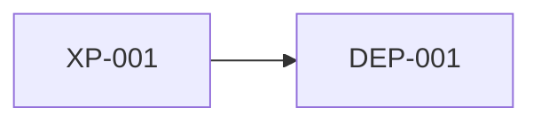

<!-- Dependency graph contract:
- Structure only: which execution paths use which internal modules and DEP-NNN IDs.
- Do not record dispositions, slice order, or decisions here. Those belong in the dependency inventory, decision register, and migration plan.
- One evidence grade per row.
- After Status: Snapshot, append Errata or produce vN+1.
- If a used dependency is missing from the inventory, stop. Do not invent DEP IDs.
- INCLUDE the mermaid diagram only when the graph has fewer than 30 nodes. Otherwise the tables are the artifact.
-->

# Dependency Graph

**Legacy repo:** `{path}`
**Version:** `{v1}`
**Status:** `{Draft | Snapshot}`
**Date:** `{YYYY-MM-DD}`
**Owner:** Archaeologist (`/map-dependency-graph`)

## Summary

{One paragraph: which paths are independent of `no-route` / `undecided` dependencies (cite the inventory, do not copy dispositions as new state), which dependencies are widely shared, and where a first slice could start. Point to the migration plan for sequencing.}

---

## 1. Path to internals and externals

| XP ID | Internal modules / functions | External DEP IDs | Evidence |
|-------|------------------------------|------------------|----------|
| XP-NNN | `{module or symbol list}` | `{DEP-NNN, …}` | `{E1\|E2\|E3\|E4\|E5}` `{citation}` |

## 2. Reverse index: dependency to paths

| DEP ID | Used by XP IDs | Evidence |
|--------|----------------|----------|
| DEP-NNN | `{XP-NNN, …}` | `{grade}` `{citation}` |

<!-- INCLUDE WHEN a mermaid diagram stays readable (fewer than 30 nodes).
     OMIT ENTIRELY otherwise. No custom colors or click events. -->

## 3. Diagram

## 4. Open graph questions

- [ ] `{path whose callees could not be recovered}`

## Errata

| Date | Row | Correction | Evidence |
|------|-----|------------|----------|
| `{YYYY-MM-DD}` | `{XP-NNN or DEP-NNN}` | `{corrected edge}` | `{grade}` `{citation}` |

Write `None.` when there are no errata.

## Links

- Path inventory: `{pathInventoryDoc}`
- Dependency inventory: `{dependencyInventoryDoc}`
- Migration plan: `{migrationPlanDoc}`
