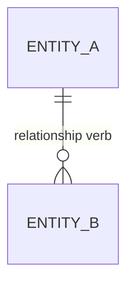

<!--
Domain model artifact contract:
- This file is produced or updated by /model-domain (modeler in Domain mode).
- Save it to the configured domain path (default `docs/DOMAIN.md`).
- DOMAIN.md is canonical for ubiquitous language, data meaning, entities, relationships, invariants, lifecycles, and consistency boundaries.
- Every term, field, invariant, lifecycle, and relationship must trace to source material or a resolved question.
- Open modeling questions block design or story planning for affected scope.
-->

# Domain Model: {Product name}

**Source material:** {bullet list of purpose, requirements, decisions, transcripts, or user answers consumed}
**Date:** {YYYY-MM-DD}
**Status:** Draft | Approved | Superseded (link to replacement)

---

## 1. Purpose alignment

{Briefly restate how this domain model serves the configured purpose document. Link to the purpose artifact.}

## 2. Ubiquitous language

{Preferred terms the project uses everywhere: requirements, stories, code, tests, docs, and UI. Each term should define meaning, accepted aliases, and rejected synonyms.}

| Term | Definition | Accepted aliases | Do not use | Source |
|------|------------|------------------|------------|--------|
| `{Term}` | {precise domain meaning} | {if any} | {synonyms to avoid} | {REQ/Sn/user answer} |

## 3. Data dictionary

{Every persisted, exchanged, displayed, or tested domain field named by the source material. Use `TBD` only with a matching open modeling question.}

| Field | Owner entity | Type / format | Required? | Constraints / allowed values | Source of value | Source |
|-------|--------------|---------------|-----------|------------------------------|-----------------|--------|
| `{Entity.attribute}` | `{Entity}` | `{type/unit/format}` | Yes / No / Conditional | {range, uniqueness, immutability, validation} | {user, system, external service, derived} | {REQ/Sn/user answer} |

## 4. Core entities

{Entities are concepts in the product domain, not implementation classes. Each entity needs meaning and invariants.}

### `{Entity}`

- **Meaning:** {what this entity represents in the domain}
- **Key attributes:** `{field}`, `{field}`
- **Identity:** {what makes one instance the same instance over time}
- **Invariants:**
  - {always-true rule}
- **Lifecycle:** {link to Section 7 lifecycle or write `TBD` with an open question}
- **Source:** {REQ/Sn/user answer}

## 5. Relationships

{Show cardinality, ownership, and important relationship verbs. Keep labels in domain language.}

| Relationship | Cardinality | Ownership / lifecycle dependency | Source |
|--------------|-------------|-----------------------------------|--------|
| `{EntityA}` -> `{EntityB}` | one-to-many / many-to-many / etc. | {who creates, deletes, or controls whom} | {REQ/Sn/user answer} |

## 6. Aggregates / consistency boundaries

{Name the domain boundaries inside which invariants must be maintained together. These often map to ports, adapters, transactions, or service boundaries during design.}

| Boundary | Entities inside | Invariants protected | External interactions | Design implications |
|----------|-----------------|----------------------|-----------------------|---------------------|
| `{Boundary}` | `{Entity}`, `{Entity}` | {rules that must remain consistent together} | {other boundaries/services/files} | {ports/adapters likely needed, if known} |

## 7. Lifecycles and state transitions

{For each entity with meaningful states, name states, events, guards, and outcomes.}

### `{Entity}` lifecycle

| From state | Event / command | Guard | To state | Side effects | Source |
|------------|-----------------|-------|----------|--------------|--------|
| `{state}` | `{event}` | {condition} | `{state}` | {domain-visible effect} | {REQ/Sn/user answer} |

## 8. Domain events

{Events that matter to the domain even if no event bus exists. These help the Architect avoid losing important transitions.}

| Event | Emitted when | Carries | Consumers / observers | Source |
|-------|--------------|---------|-----------------------|--------|
| `{EventName}` | {trigger} | {fields} | {actor/system/use case} | {REQ/Sn/user answer} |

## 9. Open modeling questions

{Questions about terms, attributes, cardinality, lifecycle, invariants, ownership, unit/format, or boundaries that remain unresolved. Each blocks affected downstream work.}

- [ ] ...

## 10. Links

- Purpose: {configured purpose path, default `docs/PURPOSE.md`}
- Related requirements: {REQ-NNN ...}
- Related ADRs: {ADR-NNN ...}

---

*Created: {YYYY-MM-DD} | Modeled by: modeler in Domain Mode*
