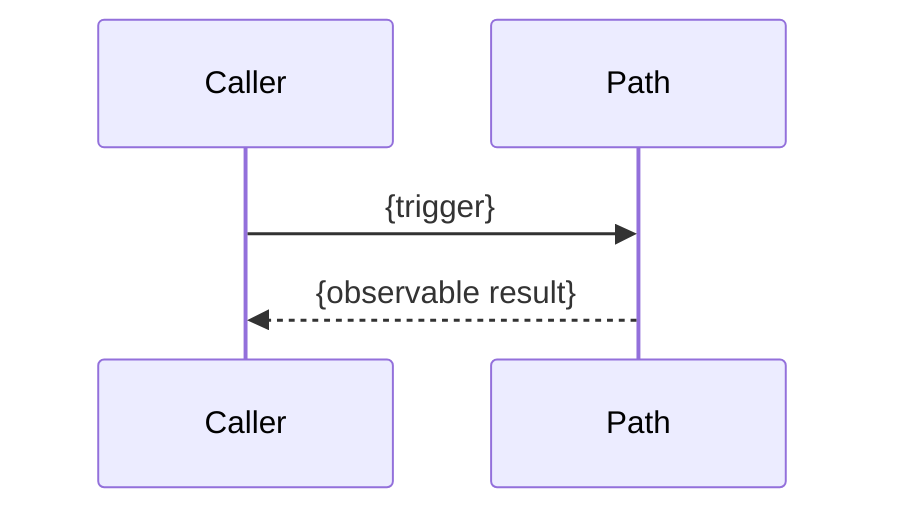

<!-- Execution path detail contract:
- One XP-NNN (or a tight group of related triggers for the same operation).
- Describe what the legacy path does, not what the port should do.
- One evidence grade per claim. Split mixed-grade statements into separate rows.
- Do not record port status, slice progress, or decision preambles. Cite DEC/DEF/IMP by ID only.
- After Status: Snapshot, append Errata or produce vN+1.
- INCLUDE the sequence diagram only when there are 3+ distinct actors or an async hop.
- INCLUDE data-store rows only when this path reads or writes a store.
- Omit unused sections. Do not write N/A.
-->

# XP-NNN: {Path title}

**Inventory ID:** `{XP-NNN}`
**Trigger:** `{library API / CLI / job / endpoint / event}` `{name}`
**Status:** `{Draft | Ready for Requirements | Snapshot}`
**Version:** `{v1}`
**Date:** `{YYYY-MM-DD}`
**Owner:** Archaeologist (`/trace-path`)

## Summary

{One paragraph: what this path does when triggered, what goes in and out, and the weakest evidence grade that still matters for planning. Point to the test plan for how it will be proved and to DEF/DEC IDs for mismatches. Do not retell the whole inventory.}

---

## 1. Sequence of operations

| Step | What happens | Legacy location | Evidence |
|------|--------------|-----------------|----------|
| 1 | `{action}` | `{path:line or symbol}` | `{E1\|E2\|E3\|E4\|E5}` `{citation}` |

Prefer 5–15 rows. Group sub-steps rather than tracing every instruction.

<!-- INCLUDE WHEN 3+ distinct actors or an async/store hop. OMIT ENTIRELY otherwise. -->

### Sequence diagram

## 2. Internal dependencies

| Module / function | Role in this path | Evidence |
|-------------------|-------------------|----------|
| `{symbol}` | `{what it does here}` | `{grade}` `{citation}` |

## 3. External dependencies

| DEP ID | How this path uses it | Evidence |
|--------|-----------------------|----------|
| DEP-NNN | `{call, link, spawn, network}` | `{grade}` `{citation}` |

Cite IDs from the dependency inventory. Do not restate license, disposition, or substitution.

## 4. Data flow

| Direction | What | Shape / units | Side effects | Evidence |
|-----------|------|---------------|--------------|----------|
| in | `{input}` | `{type, units, range if known}` | `{none, or effect}` | `{grade}` `{citation}` |
| out | `{output}` | `{type, precision, ordering}` | `{none, file, store, stdout}` | `{grade}` `{citation}` |

<!-- INCLUDE WHEN this path reads or writes a store, file, or queue. OMIT ENTIRELY otherwise. -->

## 5. Stores and files

| Store / file | Operation | Evidence |
|--------------|-----------|----------|
| `{path or connection}` | `{read/write}` | `{grade}` `{citation}` |

## 6. Edge cases and error handling

| Case | What the legacy path actually does | Evidence | Defect |
|------|--------------------------------------|----------|--------|
| `{empty input / overflow / missing file / …}` | `{observed or code-derived behavior}` | `{grade}` `{citation}` | `{DEF-NNN or none}` |

Describe behavior, not desired behavior. If it looks wrong, add a `DEF-NNN` — do not decide reproduce vs fix here.

## 7. Open questions

- [ ] `{question that would change planning for THIS path}`

Questions that affect many paths belong in the decision register, not copied into every detail doc.

## Errata

| Date | Row / section | Correction | Evidence |
|------|---------------|------------|----------|
| `{YYYY-MM-DD}` | `{step or claim}` | `{corrected fact}` | `{grade}` `{citation}` |

Write `None.` when there are no errata.

## Links

- Path inventory: `{pathInventoryDoc}`
- Dependency graph: `{dependencyGraphDoc}`
- Path test plan: `{pathTestPlanDoc}`
- Defect ledger: `{defectLedgerDoc}`
