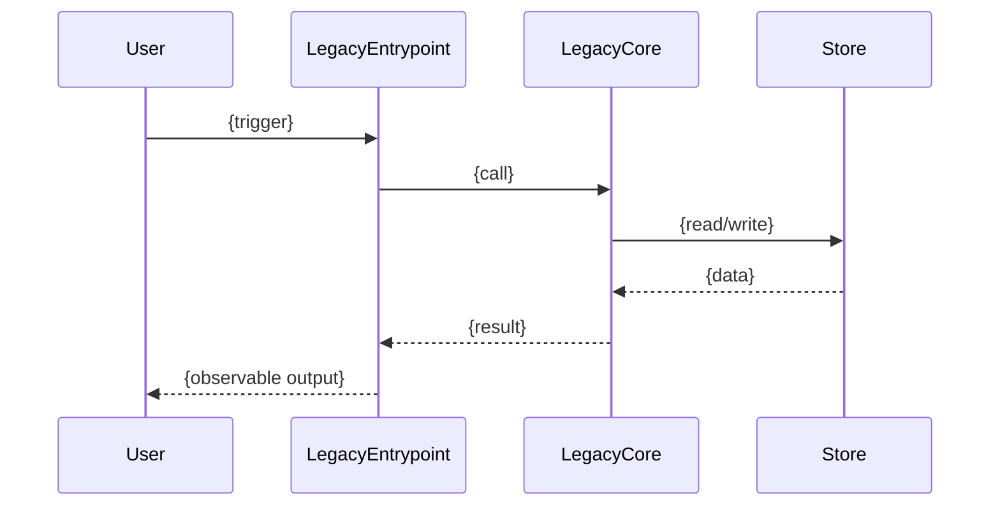
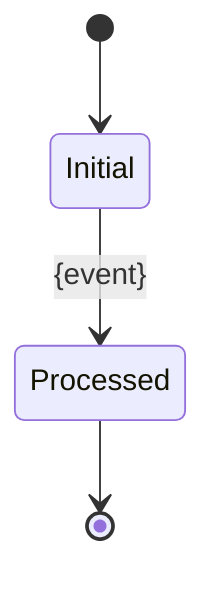

<!-- Legacy flow contract:
- Trace one behavior or entrypoint through legacy code and observable effects.
- Mark unrecoverable regions explicitly.
- Use Mermaid diagrams without custom styling.
-->

# Legacy Flow: {Flow title}

**Behavior:** `{BEH-NNN or entrypoint}`
**Legacy surface:** `{screen/command/job/API}`
**Evidence grade:** `{E1/E2/E3/E4/E5}`
**Date:** `{YYYY-MM-DD}`

---

## 1. Scope

{What flow is traced and what is intentionally out of scope.}

## 2. Sequence diagram

## 3. Step trace

| Step | Legacy location | Action | Data in/out | Evidence grade | Notes |
|------|-----------------|--------|-------------|----------------|-------|
| 1 | `{path:line}` | `{action}` | `{data}` | `{E1/E2/E3/E4/E5}` | `{notes}` |

## 4. State transitions

## 5. Unrecoverable or ambiguous regions

| Region | Why ambiguous | Impact | Required decision |
|--------|---------------|--------|-------------------|
| `{path/range}` | `{reason}` | `{impact}` | `{question}` |

## 6. Port implications

| Implication | Affected artifact | Evidence |
|-------------|-------------------|----------|
| `{implication}` | `{REQ/DOMAIN/ADR/STORY}` | `{grade + citation}` |

## 7. Links

- Behavior: `{BEH-NNN}`
- Translation gaps: `{translationGapDoc}`
- Oracle: `{oracleDoc}`

*Created: {YYYY-MM-DD}*
