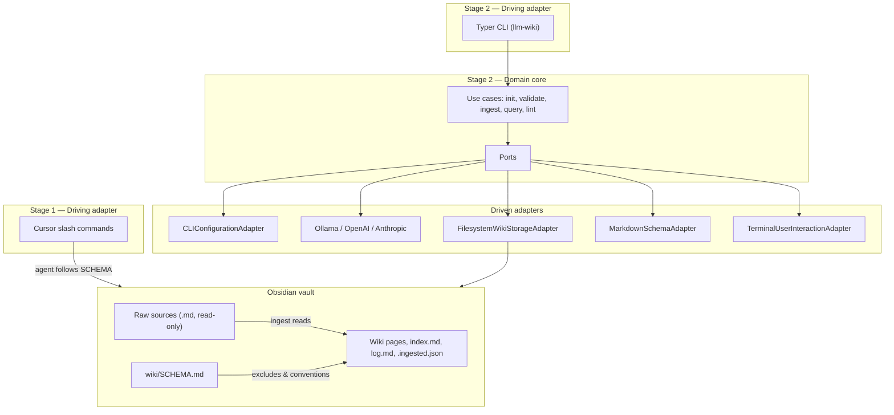

# ADD LLM Wiki

An **Artifact-Driven Development (ADD)** showcase that implements [Andrej Karpathy's LLM-wiki pattern](https://gist.github.com/karpathy/442a6bf555914893e9891c11519de94f) for **existing Obsidian vaults**: raw vault markdown stays read-only; an LLM maintains a persistent, interlinked wiki in a vault subdirectory (default `wiki/`).

**Delivery is staged:**

- **Stage 1 (Cursor-first):** Fully usable init, ingest, query, and lint via `.cursor/commands/` and `wiki/SCHEMA.md` on a real vault — no Python CLI required.
- **Stage 2 (standalone CLI):** Python hexagonal core with `llm-wiki` terminal commands, Ollama / OpenAI / Anthropic adapters.
- **Future:** Obsidian plugin as an additional driving adapter on the same domain core.

Requirements and design traceability live under `docs/requirements/`, `docs/decisions/`, and `docs/features/`.

## Table of Contents

- [Requirements](#requirements)
- [High-Level Architecture](#high-level-architecture)
- [Technical Stack](#technical-stack)
- [Key Design Decisions](#key-design-decisions)
- [Prerequisites](#prerequisites)
- [Getting Started](#getting-started)
- [Available Scripts](#available-scripts)
- [UI Components](#ui-components)
- [API Contract](#api-contract)
- [Environment Variables](#environment-variables)
- [Backlog Items](#backlog-items)
- [License](#license)

## Requirements

Consumed requirement files (append-only):

- [docs/requirements/REQ-001-llm-wiki-cli.md](REQ-001-llm-wiki-cli.md) — LLM Wiki CLI (refined; Gherkin S1–S19)
- [docs/requirements/llm-wiki.md](llm-wiki.md) — Karpathy LLM-wiki pattern (source material)

**Architecture decisions included for traceability**

- [docs/decisions/ADR-001-hexagonal-architecture.md](ADR-001-hexagonal-architecture.md) — Hexagonal layout and dependency rules
- [docs/decisions/ADR-002-port-interfaces.md](ADR-002-port-interfaces.md) — Port contracts (`ConfigurationPort`, `LLMPort`, etc.)
- [docs/decisions/ADR-003-vault-wiki-layout.md](ADR-003-vault-wiki-layout.md) — Vault/wiki artifacts, SCHEMA.md, `.ingested.json`, log format
- [docs/decisions/ADR-004-configuration-and-llm-providers.md](ADR-004-configuration-and-llm-providers.md) — Env vars, CLI flags, provider selection, default models
- [docs/decisions/ADR-005-python-cli-packaging.md](ADR-005-python-cli-packaging.md) — `pyproject.toml`, Typer CLI, composition root, logging

## High-Level Architecture

Three conceptual layers (in the user's vault) plus two delivery mechanisms (in this repo):



**Flow summary**

1. **Init** creates `wiki/SCHEMA.md`, `index.md`, `log.md` without modifying sources (S1, S2).
2. **Ingest** reads a source file, uses the LLM to update wiki pages + index + log, records path in `.ingested.json` (S6, S7, S12).
3. **Query** uses index navigation then page reads; optional filing after user confirmation (S8).
4. **Lint** reports issues and appends to log; does not auto-fix (S9).

Stage 1 achieves the same observable vault artifacts via Cursor agents; Stage 2 encodes behavior in testable Python use cases behind ports (S14, S16, S18).

## Technical Stack

| Layer | Technology | Rationale |
|-------|------------|-----------|
| Stage 1 delivery | Cursor commands (`.cursor/commands/`) | Usable daily driver before Python exists; iterates via SCHEMA + commands |
| Stage 2 language | Python 3.11+ | REQ-001 binding; strong typing for ports |
| CLI (driving) | Typer + Rich | Subcommands, `--help`, terminal UX (ADR-005) |
| Architecture | Hexagonal (ports/adapters) | Shared core for CLI + future Obsidian plugin (ADR-001) |
| LLM — local | Ollama HTTP API | Local-first default (S11, ADR-004) |
| LLM — cloud | OpenAI SDK, Anthropic SDK | Fallback / explicit provider |
| Storage | Local filesystem via `WikiStoragePort` | Vault + wiki are markdown on disk |
| Schema | `wiki/SCHEMA.md` parsed by `SchemaPort` | Single config doc for agents and CLI |
| Testing | pytest, ruff, optional mypy | Unit + contract + integration per ADR-001 |
| Packaging | Hatchling + `pyproject.toml` | Editable install, `llm-wiki` console script |
| Human wiki UI | Obsidian | Graph, links, browsing; not built in v1 |
| Future driving adapter | Obsidian plugin | Out of scope v1; same ports (S17) |

## Key Design Decisions

### 1. Staged delivery without rework

Stage 1 must be a **Done** init/ingest/query/lint tool on a real vault (S18). Stage 2 implements the same contracts in Python; wiki artifacts and SCHEMA.md carry forward. Stage 1 must not embed shortcuts that violate hexagonal boundaries in Stage 2.

### 2. Hexagonal boundaries

Domain use cases depend only on port interfaces. Adapters are wired at the composition root (`adapters/cli/main.py`). See [ADR-001](ADR-001-hexagonal-architecture.md) and [ADR-002](ADR-002-port-interfaces.md).

### 3. Configuration is a port

All runtime settings (vault path, wiki dir, provider, keys, batch mode) flow through `ConfigurationPort`. Stage 2 ships `CLIConfigurationAdapter`; Obsidian settings adapter is future work (S19, [ADR-004](ADR-004-configuration-and-llm-providers.md)).

### 4. Source immutability

Tools never modify, delete, or rename markdown outside the wiki subdirectory (S5). Ingest state lives in `wiki/.ingested.json` only ([ADR-003](ADR-003-vault-wiki-layout.md)).

### 5. Stage 1 Cursor command names (proposed)

Final names confirmed at `/plan-project`; proposed:

| Command | Purpose |
|---------|---------|
| `/init-wiki` | Initialize wiki layout and SCHEMA |
| `/wiki-ingest` | Ingest one source or directory |
| `/wiki-query` | Question against wiki; optional filing |
| `/wiki-lint` | Health-check report |

Commands ship under `.cursor/commands/` in this repo and follow `wiki/SCHEMA.md`.

### 6. No vector RAG in v1

Navigation uses `index.md` and direct page reads per the pattern doc — no embeddings or re-ranking in early releases.

### Project Structure

```
ADD-LLM-wiki/
├── README.md
├── pyproject.toml                 # Stage 2 — Hatchling package (S2-1)
├── src/llm_wiki/
│   ├── domain/
│   │   ├── models/                # VaultContext, WikiSchema, InitResult, …
│   │   └── use_cases/             # init, validate, ingest, query, lint
│   ├── ports/                     # ConfigurationPort, LLMPort, …
│   └── adapters/
│       ├── cli/                   # Typer app + CLIConfigurationAdapter + wiring
│       ├── llm/                   # ollama, openai, anthropic
│       ├── storage/               # filesystem wiki + sources
│       ├── schema/                # SCHEMA.md parser
│       └── interaction/           # terminal prompts
├── tests/
│   ├── unit/
│   ├── contract/
│   └── integration/
├── templates/wiki/
│   ├── SCHEMA.md                  # Shipped template for init (S1-1)
│   ├── index.md                   # Starter catalog (S1-2)
│   └── log.md                     # Starter append-only log (S1-2)
├── .cursor/commands/
│   ├── init-wiki.md               # /init-wiki — S1-2
│   ├── wiki-ingest.md             # /wiki-ingest — S1-3
│   ├── wiki-query.md              # /wiki-query — S1-4
│   └── wiki-lint.md               # /wiki-lint — S1-5
├── test/vault/                    # Populated vault fixture; .obsidian stub for init smoke
└── docs/
    ├── requirements/
    ├── decisions/                 # ADR-001 … ADR-005
    └── features/                  # Story plans from /plan-story
```

The user's **wiki content** lives inside their Obsidian vault (`wiki/` by default), not in this repository.

### Logging and Observability

- **Logger:** Python stdlib `logging` per module (`llm_wiki.domain`, `llm_wiki.adapters.*`) — see [ADR-005](ADR-005-python-cli-packaging.md).
- **Format:** Plaintext to stderr; optional `LLM_WIKI_LOG=DEBUG` for development.
- **Correlation IDs:** Not required for v1 CLI (single-process). Revisit if a long-running server or plugin host appears.
- **Levels:** Standard `debug`, `info`, `warning`, `error`. User-facing outcomes also go through `UserInteractionPort` / Rich, not only logs.
- **Sensitive data:** Never log `OPENAI_API_KEY`, `ANTHROPIC_API_KEY`, or full LLM prompts/responses at INFO or below. Log provider name and model only.

## Prerequisites

**Stage 1**

- [Cursor](https://cursor.com/) with this repo's commands available (copy or open repo as workspace root when developing commands).
- An existing Obsidian vault with markdown notes outside the wiki directory.
- LLM access via Cursor agent (no local Ollama required for Stage 1).

**Stage 2**

- Python 3.11+
- `uv` or `pip` for editable install
- For local-first LLM: [Ollama](https://ollama.com/) running and a pulled model (default `llama3.2` per ADR-004)
- Optional: `OPENAI_API_KEY` and/or `ANTHROPIC_API_KEY` for cloud fallback

## Getting Started

### Stage 1 — Cursor on your vault

1. Open your **Obsidian vault** as the Cursor workspace (or a parent folder containing it).
2. Ensure this repo's `.cursor/commands/` are on the command path (develop in-repo; users may symlink or copy commands — TBD packaging story).
3. Run **`/init-wiki`** to create `wiki/SCHEMA.md`, `index.md`, and `log.md` (idempotent; vault must contain `.obsidian/` or an existing `wiki/SCHEMA.md`).
4. Run **`/wiki-ingest`** on a note (e.g. `daily/2026-05-01.md`), **`/wiki-query`** with a question, then **`/wiki-lint`** for a health-check report.

   Verify command specs in this repo: `bash scripts/verify-init-wiki-command.sh`, `bash scripts/verify-wiki-ingest-command.sh`, `bash scripts/verify-wiki-query-command.sh`, `bash scripts/verify-wiki-lint-command.sh`, and **`bash scripts/verify-stage1-e2e.sh`** for full Stage 1 E2E post-conditions on `test/vault/wiki/` (uses `test/vault/` fixture where applicable).
5. Browse the wiki in Obsidian; edit `wiki/SCHEMA.md` or commands to tune behavior.

Stage 1 acceptance: init + ingest + query + lint on a real vault without Stage 2 (S18).

### Stage 2 — Python CLI (when implemented)

```bash
# From repo root
cd /path/to/ADD-LLM-wiki
pip install -e ".[dev]"   # or: uv pip install -e ".[dev]"

# From inside your Obsidian vault
cd /path/to/my-vault
export OLLAMA_BASE_URL=http://localhost:11434   # optional
llm-wiki init
llm-wiki ingest path/to/note.md
llm-wiki query "What themes connect my recent notes?"
llm-wiki lint
llm-wiki validate
```

Use `llm-wiki --help` and subcommand `--help` for flags (`--vault`, `--wiki-dir`, `--provider`, `--batch`).

## Available Scripts

### Repository verification

| Command | Description |
|---------|-------------|
| `bash scripts/verify-wiki-schema-template.sh` | Validate `templates/wiki/SCHEMA.md` against ADR-003 (S1-1) |
| `bash scripts/verify-init-wiki-command.sh` | Validate `/init-wiki` command and init templates (S1-2) |
| `bash scripts/verify-wiki-ingest-command.sh` | Validate `/wiki-ingest` command spec (S1-3) |
| `bash scripts/verify-wiki-query-command.sh` | Validate `/wiki-query` command spec (S1-4) |
| `bash scripts/verify-wiki-lint-command.sh` | Validate `/wiki-lint` command spec (S1-5) |
| `bash scripts/verify-stage1-e2e.sh` | Stage 1 E2E post-conditions on `test/vault/wiki/` (S1-6) |
| `bash scripts/verify-s2-1-scaffold.sh` | Validate Python package scaffold and hexagonal layout (S2-1) |
| `bash scripts/verify-s2-2-ports.sh` | Validate port modules and ADR-002 method names (S2-2) |
| `bash scripts/verify-s2-4-adapters.sh` | Validate filesystem/schema adapter modules (S2-4) |
| `bash scripts/verify-s2-5-configuration.sh` | Validate CLI configuration env names vs ADR-004 (S2-5) |
| `bash scripts/verify-s2-6-llm-adapters.sh` | Validate LLM adapter stack imports vs ADR-004 (S2-6) |
| `bash scripts/verify-s2-7-interaction.sh` | Validate terminal interaction adapter (S2-7) |
| `bash scripts/verify-s2-11-cli.sh` | Validate Typer composition root wiring (S2-11) |
| `bash scripts/verify-s2-12-integration.sh` | Stage 2 contract parametrization + CLI E2E + import boundaries (S2-12) |

### Stage 2 CLI (Typer)

Stage 2 commands; exact Makefile targets TBD at scaffold:

| Command | Description |
|---------|-------------|
| `llm-wiki init` | Create wiki layout idempotently |
| `llm-wiki validate` | Check vault/wiki structure; non-zero on failure |
| `llm-wiki ingest PATH` | Ingest file or directory (`--batch` for unattended) |
| `llm-wiki query TEXT` | Answer from wiki; prompt to file result |
| `llm-wiki lint` | Report wiki health; append log entry |

**Development (planned in `pyproject.toml` scripts):**

| Command | Description |
|---------|-------------|
| `pytest` | Run unit, contract, integration tests |
| `ruff check .` | Lint |
| `ruff format .` | Format |

## UI Components

No web UI in v1.

| Surface | Location | Description |
|---------|----------|-------------|
| Cursor commands | `.cursor/commands/` | Stage 1 driving adapter — agent-operated workflows |
| Terminal CLI | `llm-wiki` entrypoint | Stage 2 driving adapter |
| Obsidian | User's vault | Read/browse wiki; graph view |

## API Contract

### CLI ↔ use cases

| CLI subcommand | Use case | Primary scenarios |
|----------------|----------|-------------------|
| `init` | `InitUseCase` | S1, S2 |
| `validate` | `ValidateUseCase` | S10 |
| `ingest [path]` | `IngestUseCase` | S6, S7, S12 |
| `query <text>` | `QueryUseCase` | S8 |
| `lint` | `LintUseCase` | S9 |

Global options (composition root / `ConfigurationPort`): `--vault`, `--wiki-dir`, `--provider`; ingest adds `--batch`.

### Port contracts

Detailed method lists: [ADR-002](ADR-002-port-interfaces.md).

### Wiki artifacts (filesystem contract)

| Path | Mutability | Role |
|------|------------|------|
| `wiki/SCHEMA.md` | Human + tool at init | Excludes, workflows, conventions |
| `wiki/index.md` | LLM/tool | Page catalog |
| `wiki/log.md` | Append-only | Chronological operations |
| `wiki/.ingested.json` | Tool | Ingest idempotency sidecar |
| `wiki/**/*.md` | LLM/tool | Wiki pages |
| Vault `**/*.md` outside wiki | **Read-only** for tool | Sources |

Log heading format: `## [YYYY-MM-DD] {operation} | {title}` (S13).

## Environment Variables

See [ADR-004](ADR-004-configuration-and-llm-providers.md). CLI flags override env when both apply.

| Variable | Default | Description |
|----------|---------|-------------|
| `LLM_WIKI_DIR` | `wiki` | Wiki subdirectory name under vault |
| `LLM_WIKI_PROVIDER` | (auto) | Force `ollama`, `openai`, or `anthropic` |
| `OLLAMA_BASE_URL` | `http://localhost:11434` | Ollama API base |
| `OLLAMA_MODEL` | `llama3.2` | Ollama model tag |
| `OPENAI_API_KEY` | — | OpenAI credential |
| `OPENAI_MODEL` | `gpt-4o-mini` | OpenAI model |
| `ANTHROPIC_API_KEY` | — | Anthropic credential |
| `ANTHROPIC_MODEL` | `claude-3-5-sonnet-20241022` | Anthropic model |
| `LLM_WIKI_LOG` | — | Set to `DEBUG` for verbose adapter logging |

Provider priority when not overridden: Ollama if reachable → OpenAI if key set → error with guidance (S11). Anthropic requires `--provider anthropic`.

## Backlog Items

Backlog derived from [REQ-001](REQ-001-llm-wiki-cli.md) delivery phases and accepted ADRs. Run **`/plan-story <id>`** to author story documents under `docs/features/`.

### Epic 1: Stage 1 — Cursor daily driver

Fully usable init, ingest, query, and lint on a real Obsidian vault via `templates/wiki/SCHEMA.md` and `.cursor/commands/` — no Python CLI required (S14, S18). **Epic 1 is Done** — Stage 2 may proceed.

| ID | Status | Story | Size | Notes |
| ---- | -------- | --------------------------------------------------------------------- | ---- | ------------------------------------------------------------------------------------------- |
| [S1-1](S1-1-wiki-schema-template.md) | **Done** | Ship `templates/wiki/SCHEMA.md` with layers, workflows, default excludes, log format | S | ADR-003; scenarios S4, S13; verify: `scripts/verify-wiki-schema-template.sh` |
| [S1-2](S1-2-init-wiki-command.md) | **Done** | Implement `/init-wiki` Cursor command | M | `.cursor/commands/init-wiki.md`; scenarios S1, S2, S3, S5, S13; verify: `scripts/verify-init-wiki-command.sh` |
| [S1-3](S1-3-wiki-ingest-command.md) | **Done** | Implement `/wiki-ingest` Cursor command | L | Interactive + batch directory; `.ingested.json` S6, S7, S12; immutability S5 |
| [S1-4](S1-4-wiki-query-command.md) | **Done** | Implement `/wiki-query` Cursor command | M | Index-first answer + optional filing prompt S8; verify: `scripts/verify-wiki-query-command.sh` |
| [S1-5](S1-5-wiki-lint-command.md) | **Done** | Implement `/wiki-lint` Cursor command | M | Report-only lint + log append S9, S13; verify: `scripts/verify-wiki-lint-command.sh` |
| [S1-6](S1-6-stage1-e2e-acceptance.md) | **Done** | Stage 1 end-to-end acceptance on a real vault | S | QA gate S18; evidence: [S1-6-acceptance-evidence.md](S1-6-acceptance-evidence.md); verify: `scripts/verify-stage1-e2e.sh` |

### Epic 2: Stage 2 — Hexagonal Python CLI

Python domain core, driven adapters, and `llm-wiki` Typer CLI per ADR-001–005. Reuses Stage 1 vault/wiki contracts; does not replace wiki artifacts (S16, S17).

| ID | Status | Story | Size | Notes |
| ---- | -------- | --------------------------------------------------------------------- | ---- | ------------------------------------------------------------------------------------------- |
| [S2-1](S2-1-python-package-scaffold.md) | **Done** | Python package scaffold (`pyproject.toml`, `src/llm_wiki/`, dev tooling) | S | ADR-005; verify: `scripts/verify-s2-1-scaffold.sh` |
| [S2-2](S2-2-port-protocols-and-domain-models.md) | **Done** | Define port protocols and domain models | M | ADR-002; verify: `scripts/verify-s2-2-ports.sh`; contract tests in `tests/contract/` |
| [S2-3](S2-3-init-and-validate-use-cases.md) | **Done** | Implement `InitUseCase` and `ValidateUseCase` with unit tests | M | S1, S2, S10; verify: `pytest tests/unit/test_init_use_case.py tests/unit/test_validate_use_case.py` |
| [S2-4](S2-4-filesystem-storage-and-schema-adapters.md) | Complete | Implement filesystem `WikiStoragePort` and `SchemaPort` adapters | M | ADR-003; excludes, `.ingested.json`, source immutability S5, S12 |
| [S2-5](S2-5-cli-configuration-adapter.md) | Complete | Implement `CLIConfigurationAdapter` and vault walk-up | M | ADR-004; S3, S11, S19; verify: `scripts/verify-s2-5-configuration.sh` |
| [S2-6](S2-6-llm-port-adapters.md) | Complete | Implement `LLMPort` and Ollama / OpenAI / Anthropic adapters | L | ADR-004; provider priority S11; verify: `scripts/verify-s2-6-llm-adapters.sh` |
| [S2-7](S2-7-terminal-interaction-adapter.md) | Complete | Implement `TerminalUserInteractionAdapter` | S | S6, S8; verify: `scripts/verify-s2-7-interaction.sh` |
| [S2-8](S2-8-ingest-use-case.md) | Complete | Implement `IngestUseCase` with unit tests | L | S6, S7, S12, S13; verify: `pytest tests/unit/test_ingest_use_case.py` |
| [S2-9](S2-9-query-use-case.md) | Complete | Implement `QueryUseCase` with unit tests | M | S8; verify: `pytest tests/unit/test_query_use_case.py` |
| [S2-10](S2-10-lint-use-case.md) | Complete | Implement `LintUseCase` with unit tests | M | S9, S13; verify: `pytest tests/unit/test_lint_use_case.py tests/contract/test_storage_port_contract.py tests/integration/test_filesystem_wiki_storage.py::list_wiki_pages_D2 tests/integration/test_filesystem_wiki_storage.py::list_wiki_pages_binding_Y2` |
| [S2-11](S2-11-typer-cli-composition-root.md) | Complete | Typer CLI composition root (`init`, `validate`, `ingest`, `query`, `lint`) | M | ADR-005; verify: `scripts/verify-s2-11-cli.sh`; `pytest tests/integration/test_cli_commands.py` |
| [S2-12](S2-12-port-contract-and-cli-integration-tests.md) | Complete | Port contract tests and CLI integration tests | M | S16; verify: `scripts/verify-s2-12-integration.sh`; traceability: [S2-12-scenario-traceability.md](S2-12-scenario-traceability.md) |

### Epic 3: Future — Obsidian plugin (out of v1 scope)

Obsidian TypeScript driving adapter; **no in-process Python** in Electron (ADR-005). Preferred integration: subprocess to `llm-wiki`.

| ID | Status | Story | Size | Notes |
| ---- | -------- | --------------------------------------------------------------------- | ---- | ------------------------------------------------------------------------------------------- |
| PLG-1 | Not Started | ADR for plugin subprocess contract (`--json`, PATH discovery, errors) | S | Depends Epic 2 **Done**; unblocks PLG-2 |
| PLG-2 | Not Started | Obsidian plugin shell + settings → env/flags + subprocess to CLI | L | S17; `ObsidianConfigurationAdapter`; depends PLG-1, S2-11 |

## License

MIT © Philip Teitel
