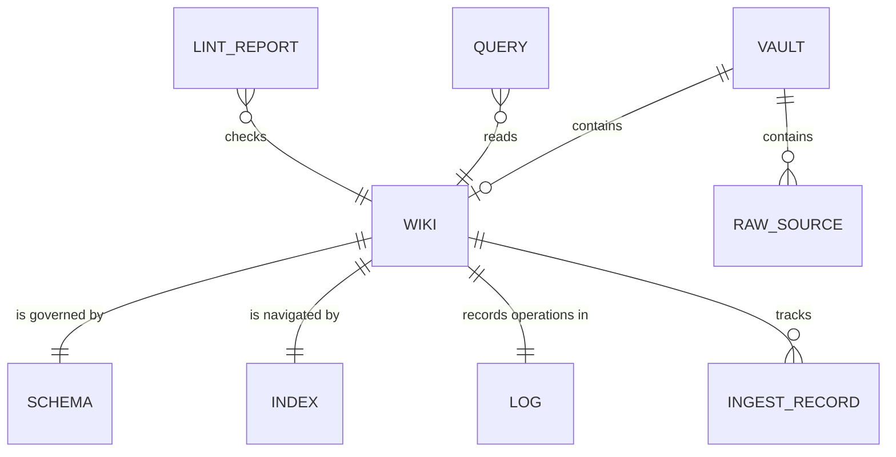

# Domain Model: ADD LLM Wiki

**Source material:**
- `docs/PURPOSE.md`
- `docs/requirements/REQ-001-llm-wiki-cli.md`
- `docs/decisions/ADR-001-hexagonal-architecture.md`
- `docs/decisions/ADR-002-port-interfaces.md`
- `docs/decisions/ADR-003-vault-wiki-layout.md`

**Date:** 2026-07-01
**Status:** Draft

---

## 1. Purpose alignment

This model supports the purpose in `docs/PURPOSE.md`: the durable wiki layer is the product's compounding artifact, while raw vault sources remain read-only and user-owned.

## 2. Ubiquitous language

| Term | Definition | Accepted aliases | Do not use | Source |
|------|------------|------------------|------------|--------|
| `Vault` | Existing Obsidian vault directory that contains raw markdown sources and may contain a wiki subdirectory. | Obsidian vault | project, repo | REQ-001 S1, S3 |
| `Raw source` | Markdown file in the vault outside the wiki subdirectory and outside configured excludes. It is read-only to the tool. | source note, vault source | source of truth to rewrite | REQ-001 S5, S6 |
| `Wiki` | LLM-owned markdown layer inside the vault, default `wiki/`, containing schema, index, log, pages, and ingest tracking. | wiki layer | RAG cache, chat memory | REQ-001 S1, S4 |
| `Schema` | `wiki/SCHEMA.md`, the human-editable convention and configuration document for agents and CLI. | SCHEMA.md | hidden config | REQ-001 S4 |
| `Index` | `wiki/index.md`, the navigational catalog the LLM reads before querying pages. | catalog | vector index | REQ-001 S1, S8 |
| `Log` | `wiki/log.md`, append-only chronological record of init, ingest, query filing, and lint operations. | operation log | audit database | REQ-001 S1, S13 |
| `Ingest record` | Entry in `wiki/.ingested.json` recording a source path and ingest timestamp. | sidecar entry | source marker | REQ-001 S7, S12 |
| `LLM provider` | Ollama, OpenAI, or Anthropic completion backend selected through configuration. | provider | model hard-coded in domain | REQ-001 S11 |
| `Configuration` | Resolved runtime settings exposed through `ConfigurationPort`. | runtime settings | environment access in domain | REQ-001 S19 |
| `User confirmation` | Explicit user decision before filing query answers or applying interactive ingest decisions. | confirmation prompt | automatic filing | REQ-001 S6, S8 |

## 3. Data dictionary

| Field | Owner entity | Type / format | Required? | Constraints / allowed values | Source of value | Source |
|-------|--------------|---------------|-----------|------------------------------|-----------------|--------|
| `Vault.root_path` | `Vault` | absolute filesystem path | Yes | Must identify an Obsidian vault by `.obsidian/` or existing `wiki/SCHEMA.md` | CLI flag or CWD detection via `ConfigurationPort` | REQ-001 S1, S3 |
| `Wiki.directory` | `Wiki` | path relative to vault, default `wiki/` | Yes | Configurable via `ConfigurationPort`; raw sources outside it are read-only | CLI flag/default | REQ-001 S1 |
| `Schema.exclude_paths` | `Schema` | list of path patterns | Yes | Defaults include `.obsidian/`, wiki directory, dotfiles | `wiki/SCHEMA.md` | REQ-001 S4, S7 |
| `Index.content` | `Index` | markdown | Yes | Standard markdown links, not Obsidian wikilinks | LLM/wiki updates | REQ-001 S1, S8 |
| `Log.entry_heading` | `Log` | markdown heading `## [YYYY-MM-DD] {operation} | {title}` | Yes | Grep-parseable prefix format | operation completion | REQ-001 S13 |
| `IngestRecord.source_path` | `Ingest record` | vault-relative markdown path | Yes | Must not point inside wiki directory or excludes | ingest use case | REQ-001 S12 |
| `IngestRecord.ingested_at` | `Ingest record` | timestamp | Yes | Written only after successful ingest | ingest use case | REQ-001 S12 |
| `Configuration.provider_override` | `Configuration` | enum / optional string | No | `ollama`, `openai`, `anthropic`, or unset | CLI flag/env adapter | REQ-001 S11, S19 |
| `Query.question` | `Query` | natural-language text | Yes | Printed answer may be filed only after confirmation | user input | REQ-001 S8 |
| `LintReport.findings` | `Lint report` | markdown report | Yes | Suggest fixes only; no silent page rewrite | lint use case | REQ-001 S9 |

## 4. Core entities

### `Vault`

- **Meaning:** The user's existing Obsidian vault and raw knowledge base.
- **Key attributes:** `root_path`
- **Identity:** Absolute root path.
- **Invariants:**
  - Raw sources outside the wiki directory are never modified, deleted, or renamed by the tool.
  - Commands must reject invalid vault context without leaving partial wiki state.
- **Lifecycle:** Discovered -> validated -> used by operations.
- **Source:** REQ-001 S1, S3, S5.

### `Wiki`

- **Meaning:** Persistent LLM-maintained markdown layer inside the vault.
- **Key attributes:** `directory`, `Schema`, `Index`, `Log`, `Ingest record`
- **Identity:** Vault root plus wiki directory.
- **Invariants:**
  - Required layout includes `SCHEMA.md`, `index.md`, and `log.md`.
  - Init is idempotent and does not overwrite existing wiki history.
  - Wiki links use standard markdown links.
- **Lifecycle:** Missing -> initialized -> maintained.
- **Source:** REQ-001 S1, S2, S4.

### `Raw source`

- **Meaning:** Read-only markdown input material for ingest.
- **Key attributes:** vault-relative path, content.
- **Identity:** Vault-relative path.
- **Invariants:**
  - A raw source matching excludes is skipped.
  - A raw source already listed in `.ingested.json` is skipped or reported in batch ingest.
- **Lifecycle:** Candidate -> skipped or ingested.
- **Source:** REQ-001 S5, S7, S12.

### `Query`

- **Meaning:** A user question answered from the persistent wiki.
- **Key attributes:** `question`, located wiki pages, answer, filing decision.
- **Identity:** User-submitted question at time of execution.
- **Invariants:**
  - Query reads `index.md` before relevant wiki pages.
  - Filing creates wiki updates only after user confirmation.
- **Lifecycle:** Asked -> answered -> optionally filed.
- **Source:** REQ-001 S8.

### `Lint report`

- **Meaning:** Human-readable assessment of wiki health.
- **Key attributes:** findings, suggested fixes, log entry.
- **Identity:** Lint operation timestamp.
- **Invariants:**
  - Lint suggests fixes but does not silently modify wiki pages.
  - Lint appends a log entry.
- **Lifecycle:** Generated -> reviewed by user.
- **Source:** REQ-001 S9.

## 5. Relationships

| Relationship | Cardinality | Ownership / lifecycle dependency | Source |
|--------------|-------------|-----------------------------------|--------|
| `Vault` -> `Wiki` | one vault has zero or one active wiki directory per configuration | Wiki lifecycle depends on vault context | REQ-001 S1 |
| `Vault` -> `Raw source` | one-to-many | Raw sources are owned by the user, not by the tool | REQ-001 S5 |
| `Wiki` -> `Schema` / `Index` / `Log` | one-to-one required layout | Init creates missing required pieces idempotently | REQ-001 S1, S2 |
| `Wiki` -> `Ingest record` | one-to-many | Ingest writes records after successful processing | REQ-001 S12 |

## 6. Aggregates / consistency boundaries

| Boundary | Entities inside | Invariants protected | External interactions | Design implications |
|----------|-----------------|----------------------|-----------------------|---------------------|
| `Vault boundary` | `Vault`, `Raw source` references | Raw source immutability; invalid vault rejection | filesystem | `WikiStoragePort` must enforce read-only source access |
| `Wiki boundary` | `Wiki`, `Schema`, `Index`, `Log`, `Ingest record`, wiki pages | Required layout, standard link format, append-only log, sidecar tracking | filesystem and LLM-written content | `WikiStoragePort` and `SchemaPort` own layout and parsing |
| `LLM operation boundary` | ingest/query/lint prompts and responses | Provider selection through configuration; no provider SDK in domain | LLM provider adapters | `LLMPort` isolates provider-specific calls |
| `User decision boundary` | `User confirmation`, interactive ingest checkpoints, query filing decision | No filing or interactive operation proceeds silently when confirmation is required | terminal now, Obsidian plugin later | `UserInteractionPort` isolates prompts and confirmations |
| `Configuration boundary` | `Configuration` | Use cases never read env vars or CLI args directly | CLI flags, env vars, future plugin settings | `ConfigurationPort` supplies resolved values |

## 7. Lifecycles and state transitions

### `Wiki` lifecycle

| From state | Event / command | Guard | To state | Side effects | Source |
|------------|-----------------|-------|----------|--------------|--------|
| Missing | init | valid vault context | Initialized | create wiki directory, `SCHEMA.md`, `index.md`, `log.md` | REQ-001 S1 |
| Initialized | init | required pieces already exist | Initialized | create only missing pieces; report existing vs added | REQ-001 S2 |
| Initialized | ingest | source not excluded and not already ingested | Maintained | update pages, index, log, `.ingested.json` | REQ-001 S6, S12 |
| Maintained | query with filing confirmed | answer accepted | Maintained | create page, update index, append log | REQ-001 S8 |
| Maintained | lint | wiki exists | Maintained | print report and append log; no automatic fixes | REQ-001 S9 |

### `Raw source` lifecycle

| From state | Event / command | Guard | To state | Side effects | Source |
|------------|-----------------|-------|----------|--------------|--------|
| Candidate | ingest | excluded path | Skipped | report skip; no source modification | REQ-001 S7 |
| Candidate | ingest | already in `.ingested.json` | Skipped | report skip; no source modification | REQ-001 S12 |
| Candidate | ingest | eligible markdown source | Ingested | wiki updates and sidecar record; no source modification | REQ-001 S6, S12 |

## 8. Domain events

| Event | Emitted when | Carries | Consumers / observers | Source |
|-------|--------------|---------|-----------------------|--------|
| `WikiInitialized` | init creates or confirms layout | wiki directory, created/existing pieces | CLI/Cursor output, log | REQ-001 S1, S2 |
| `SourceIngested` | source successfully produces wiki updates | source path, pages changed, timestamp | log, `.ingested.json`, user output | REQ-001 S6, S12 |
| `QueryAnswered` | query answer is printed | question, cited wiki pages | user output | REQ-001 S8 |
| `QueryFiled` | user confirms filing answer | answer/page path, index update, timestamp | wiki pages, index, log | REQ-001 S8 |
| `WikiLinted` | lint report completes | findings, timestamp | user output, log | REQ-001 S9 |

## 9. Open modeling questions

- [ ] Exact provider model names remain owned by ADR-004 and configuration design, not by the domain model.
- [ ] Packaging / installation domain language for distributing Stage 1 commands is deferred to a later requirement.

## 10. Links

- Purpose: `docs/PURPOSE.md`
- Related requirements: `docs/requirements/REQ-001-llm-wiki-cli.md`
- Related ADRs: `docs/decisions/ADR-001-hexagonal-architecture.md`, `docs/decisions/ADR-002-port-interfaces.md`, `docs/decisions/ADR-003-vault-wiki-layout.md`

---

*Created: 2026-07-01 | Modeled by: modeler in Domain Mode*
